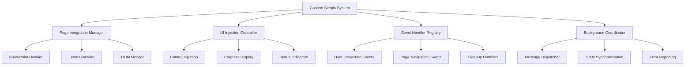

# content-scripts - Task 10

Execute task 10 for the content-scripts specification.

## Task Description
Create Teams page handler in pages/content/src/pages/teams-handler.ts

## Code Reuse
**Leverage existing code**: packages/meeting-detector Teams analysis

## Requirements Reference
**Requirements**: 1.2, 1.3

## Usage
```
/Task:10-content-scripts
```

## Instructions

Execute with @spec-task-executor agent the following task: "Create Teams page handler in pages/content/src/pages/teams-handler.ts"

```
Use the @spec-task-executor agent to implement task 10: "Create Teams page handler in pages/content/src/pages/teams-handler.ts" for the content-scripts specification and include all the below context.

# Steering Context
## Steering Documents Context (Pre-loaded)

### Product Context
# Product Vision - Meeting Summarizer Extension

## Product Overview

The Meeting Summarizer is a Chrome Extension v3 that automatically transcribes and summarizes Microsoft Teams meeting recordings stored in SharePoint. It leverages Azure Speech API's STT (Speech-to-Text) capabilities to provide intelligent meeting summaries and action item extraction for corporate users.

## Target Users

**Primary Users**: Corporate employees and teams who regularly participate in Microsoft Teams meetings
- Project managers tracking action items across multiple meetings
- Team leads needing quick meeting recaps
- Administrative staff managing meeting documentation
- Remote workers catching up on missed meetings

**User Personas**:
- **Sarah, Project Manager**: Manages multiple projects with daily standups and needs quick access to action items and decisions
- **Mike, Team Lead**: Reviews weekly team meetings to track progress and follow up on commitments
- **Lisa, Executive Assistant**: Processes multiple meeting recordings to create executive summaries

## Problem Statement

Corporate teams generate hours of meeting recordings daily, but extracting actionable insights is time-consuming:
- Manual note-taking during meetings is inefficient and often incomplete
- Post-meeting summary creation requires significant time investment
- Action items and decisions get lost in long meeting transcripts
- Teams waste time re-watching recordings to find specific information

## Solution

An intelligent browser extension that:
1. **Auto-detects** Teams meeting recordings on SharePoint pages
2. **Transcribes** audio content using Azure Speech API directly from SharePoint URLs
3. **Summarizes** meetings into digestible formats with key decisions highlighted
4. **Extracts** action items with responsible parties and deadlines
5. **Stores** results locally for quick access and reference

## Key Features

### Core Features
- **Automatic Detection**: Recognizes SharePoint pages containing Teams meeting recordings
- **One-Click Transcription**: Processes recordings without manual file downloads
- **Smart Summarization**: Generates concise meeting summaries focused on outcomes
- **Action Item Extraction**: Identifies tasks, owners, and deadlines from conversations
- **Multi-language Support**: Supports various languages through Azure Speech API

### User Experience Features
- **Progress Tracking**: Real-time processing status with estimated completion time
- **Quick Preview**: Instant access to transcription results from extension popup
- **Export Options**: Save summaries in multiple formats (text, PDF, structured data)
- **Search Functionality**: Find specific topics or action items across meeting histories

## Success Metrics

### Quantitative Metrics
- **Usage Frequency**: Daily active users and meetings processed per user
- **Time Savings**: Reduction in manual meeting summary creation time
- **Accuracy Rate**: Transcription accuracy and user satisfaction scores
- **Adoption Rate**: Installation and retention rates across target organizations

### Qualitative Metrics
- **User Satisfaction**: Feedback on summary quality and usefulness
- **Workflow Integration**: How well the tool fits into existing meeting processes
- **Action Item Tracking**: Improvement in follow-up completion rates

## Business Objectives

### Primary Objectives
1. **Increase Productivity**: Reduce time spent on meeting documentation by 70%
2. **Improve Accountability**: Enhance action item tracking and completion rates
3. **Knowledge Retention**: Create searchable meeting archives for organizational learning
4. **Remote Work Support**: Better meeting participation for distributed teams

### Secondary Objectives
- Establish foundation for broader meeting intelligence platform
- Demonstrate ROI for AI-powered productivity tools in corporate environments
- Build user base for potential premium features and enterprise offerings

## Competitive Landscape

### Direct Competitors
- **Otter.ai**: Real-time transcription with basic summarization
- **Fireflies.ai**: Meeting recording and AI-powered insights
- **Gong.io**: Sales-focused meeting analytics (enterprise)

### Competitive Advantages
- **Native SharePoint Integration**: Direct access to Teams recordings without additional setup
- **Corporate-Friendly**: No external meeting recording required, works with existing infrastructure
- **Privacy-Focused**: Local storage of sensitive meeting data
- **Multi-Browser Support**: Works across Chrome, Edge, and Firefox

## Future Roadmap

### Phase 1 (Current)
- Core transcription and summarization functionality
- SharePoint/Teams integration
- Basic action item extraction

### Phase 2 (3-6 months)
- Advanced AI-powered insights (sentiment analysis, topic clustering)
- Integration with task management tools (Jira, Asana, Microsoft Planner)
- Team collaboration features for shared meeting insights

### Phase 3 (6-12 months)
- Enterprise admin dashboard for usage analytics
- Custom vocabulary and company-specific terminology support
- API integration for third-party productivity tools

## Risk Considerations

### Technical Risks
- **API Dependencies**: Reliance on Azure Speech API availability and pricing
- **Browser Policy Changes**: Potential impacts from Chrome/Edge extension policy updates
- **SharePoint API Changes**: Microsoft platform modifications affecting URL extraction

### Business Risks
- **Privacy Concerns**: Corporate policies around AI processing of meeting content
- **Compliance Requirements**: GDPR, CCPA, and industry-specific regulations
- **Market Competition**: Established players with deeper Microsoft partnerships

## Mitigation Strategies
- Maintain local processing options to reduce external dependencies
- Implement robust privacy controls and data handling transparency
- Build strong relationships with IT departments for enterprise adoption
- Develop flexible architecture to adapt to platform changes

---

### Technology Context
# Technology Stack - Meeting Summarizer Extension

## Core Architecture

### Browser Extension Framework
- **Manifest Version**: Chrome Extension Manifest v3
- **Cross-Browser Support**: Chrome, Edge, Firefox (with platform-specific builds)
- **Architecture Pattern**: Multi-page extension with background service worker

### Frontend Technology Stack
- **Framework**: React 19.1.1
- **Language**: TypeScript 5.9.2
- **Build Tool**: Vite 6.3.5 with Rollup
- **Styling**: Tailwind CSS 3.4.17
- **State Management**: React hooks with Chrome Storage API integration

### Development Environment
- **Monorepo Management**: Turborepo 2.5.5
- **Package Manager**: PNPM 10.11.0
- **Node Version**: >= 22.15.1
- **Hot Module Replacement**: Custom HMR plugin for extension development

## Azure Integration

### Azure Speech Service
- **Primary API**: Azure Cognitive Services Speech SDK
- **Authentication**: API Key-based authentication
- **Processing Mode**: Batch transcription with direct URL input
- **Supported Features**:
  - Speech-to-Text (STT) with high accuracy
  - Multi-language support
  - Real-time and batch processing modes
  - Direct audio URL processing (no local downloads required)

### API Configuration
```typescript
// Azure Speech Configuration
interface AzureSpeechConfig {
  subscriptionKey: string;
  serviceRegion: string;
  endpoint: string;
  language: string;
  outputFormat: 'detailed' | 'simple';
}
```

### Processing Workflow
1. **URL Extraction**: Extract SharePoint video/audio URLs from Teams meeting pages
2. **Direct Processing**: Send URLs directly to Azure Speech API
3. **Batch Transcription**: Use Azure's batch transcription service for large files
4. **Result Processing**: Parse transcription results and generate summaries

## Browser Extension Components

### Background Service Worker
```typescript
// Background script responsibilities
- Azure API communication
- Transcription job management
- Result caching and storage
- Cross-tab communication
- Error handling and retry logic
```

### Content Scripts
```typescript
// Content script responsibilities
- SharePoint/Teams page detection
- Video/audio URL extraction
- DOM manipulation for UI injection
- Page-specific event handling
```

### Popup Interface
```typescript
// Popup UI responsibilities
- Transcription controls
- Progress monitoring
- Quick result preview
- Settings access
```

### Options Page
```typescript
// Options page responsibilities
- Azure API configuration
- Language preferences
- Storage management
- Privacy settings
```

## Data Processing Pipeline

### 1. Content Detection
```typescript
interface MeetingDetection {
  pageType: 'sharepoint' | 'teams';
  meetingId: string;
  audioUrls: string[];
  metadata: {
    title: string;
    date: Date;
    participants: string[];
  };
}
```

### 2. Transcription Processing
```typescript
interface TranscriptionJob {
  jobId: string;
  audioUrl: string;
  status: 'pending' | 'processing' | 'completed' | 'failed';
  progress: number;
  result?: TranscriptionResult;
}

interface TranscriptionResult {
  text: string;
  confidence: number;
  timestamp: Date;
  speakers?: SpeakerInfo[];
  segments: TranscriptionSegment[];
}
```

### 3. Summary Generation
```typescript
interface MeetingSummary {
  summary: string;
  keyPoints: string[];
  actionItems: ActionItem[];
  decisions: string[];
  nextSteps: string[];
}

interface ActionItem {
  task: string;
  assignee?: string;
  deadline?: Date;
  priority: 'high' | 'medium' | 'low';
}
```

## Storage Architecture

### Chrome Storage API Integration
```typescript
// Storage structure
interface StorageSchema {
  meetings: Record<string, MeetingRecord>;
  settings: UserSettings;
  cache: TranscriptionCache;
}

interface MeetingRecord {
  id: string;
  metadata: MeetingMetadata;
  transcription: TranscriptionResult;
  summary: MeetingSummary;
  createdAt: Date;
  updatedAt: Date;
}
```

### Local Storage Strategy
- **Transcription Results**: Stored locally using Chrome Storage API
- **Cache Management**: LRU cache for recent transcriptions
- **Privacy**: No cloud storage of meeting content
- **Sync**: Optional sync across user's browsers (Chrome sync)

## Security Considerations

### API Key Management
```typescript
// Secure storage of Azure credentials
interface SecureConfig {
  encryptedApiKey: string;
  region: string;
  // API key stored in Chrome storage with encryption
}
```

### Privacy Protection
- **Local Processing**: All sensitive data remains local
- **Encrypted Storage**: API keys and settings encrypted at rest
- **No External Logging**: Meeting content never sent to external analytics
- **User Consent**: Clear permissions for SharePoint access

### Content Security Policy
```typescript
// CSP for extension security
{
  "content_security_policy": {
    "extension_pages": "script-src 'self'; object-src 'self'; connect-src https://*.cognitiveservices.azure.com https://*.speech.microsoft.com"
  }
}
```

## Performance Optimization

### Processing Efficiency
- **Streaming**: Process large audio files in chunks
- **Caching**: Cache transcription results to avoid reprocessing
- **Background Processing**: Non-blocking transcription jobs
- **Progressive Enhancement**: Show partial results as they become available

### Memory Management
```typescript
// Efficient resource management
class TranscriptionManager {
  private jobQueue: Map<string, TranscriptionJob> = new Map();
  private resultCache: LRUCache<string, TranscriptionResult>;
  
  async processAudio(url: string): Promise<TranscriptionResult> {
    // Implement efficient processing pipeline
  }
}
```

## Cross-Browser Compatibility

### Firefox Support
```typescript
// Firefox-specific manifest adjustments
{
  "browser_specific_settings": {
    "gecko": {
      "id": "meeting-summarizer@company.com",
      "strict_min_version": "109.0"
    }
  }
}
```

### Edge Support
- **Chromium-based**: Uses same codebase as Chrome
- **Microsoft Store**: Additional packaging for Edge Add-ons store
- **SharePoint Integration**: Enhanced integration with Microsoft ecosystem

## Development Tools

### Code Quality
- **ESLint**: TypeScript/React linting with custom rules
- **Prettier**: Code formatting with Tailwind plugin
- **TypeScript**: Strict type checking enabled
- **Husky**: Pre-commit hooks for quality gates

### Testing Framework
```typescript
// Testing strategy
- Unit Tests: Jest with React Testing Library
- Integration Tests: WebdriverIO for E2E testing
- API Tests: Mock Azure Speech API responses
- Browser Tests: Cross-browser compatibility testing
```

### Build Pipeline
```typescript
// Build configuration
{
  "scripts": {
    "dev": "turbo watch dev --env CLI_CEB_DEV=true",
    "build": "turbo build --env production",
    "build:firefox": "turbo build --env CLI_CEB_FIREFOX=true",
    "test": "turbo test --continue",
    "lint": "turbo lint --continue"
  }
}
```

## API Integration Details

### Azure Speech SDK Usage
```typescript
import { SpeechConfig, AudioConfig, SpeechRecognizer } from 'microsoft-cognitiveservices-speech-sdk';

class AzureSpeechService {
  private config: SpeechConfig;
  
  constructor(subscriptionKey: string, region: string) {
    this.config = SpeechConfig.fromSubscription(subscriptionKey, region);
  }
  
  async transcribeFromUrl(audioUrl: string): Promise<TranscriptionResult> {
    // Implement batch transcription with URL input
    // Use --input URL parameter for direct processing
  }
}
```

### SharePoint URL Extraction
```typescript
class SharePointExtractor {
  detectMeetingPage(): boolean {
    // Detect SharePoint meeting pages
    return window.location.hostname.includes('sharepoint.com') ||
           window.location.hostname.includes('teams.microsoft.com');
  }
  
  extractAudioUrls(): string[] {
    // Extract video/audio manifest URLs from SharePoint
    // Parse Teams meeting page structure
  }
}
```

## Module Import Standards

### Extensionless Imports Policy
The project enforces **Always use Extensionless Imports** as a core development standard to maintain clean, maintainable code and follow modern TypeScript best practices.

#### Project Standard
```typescript
// ✅ Correct - Extensionless imports
import { MeetingData } from './types/meeting';
import { ColorfulLogger } from '../utils/colorful-logger';
import * as helpers from './utils/helpers';

// ❌ Incorrect - Imports with extensions
import { MeetingData } from './types/meeting.js';
import { ColorfulLogger } from '../utils/colorful-logger.js';
```

#### TypeScript Configuration
```json
{
  "compilerOptions": {
    "moduleResolution": "bundler",
    "allowImportingTsExtensions": false,
    "noEmit": false
  }
}
```

#### ModuleResolution Support Matrix
| ModuleResolution | Extensionless Imports | tsc-alias Required | Use Case |
|-----------------|---------------------|-------------------|----------|
| `bundler` | ✅ Full Support | ❌ No | Build tools (Vite, Webpack) |
| `node16`/`nodenext` | ❌ Extensions Required | ✅ Yes | Pure Node.js runtime |
| `node` (legacy) | ⚠️ Limited | ✅ Yes | Legacy Node.js |

#### Technical Exceptions
Only **2 files** in the entire project require `.js` extensions due to Node.js runtime requirements:

1. **`packages/i18n/lib/prepare-build.ts`** - Build script executed directly by Node.js
2. **`packages/i18n/lib/set-related-locale-import.ts`** - Runtime utility for locale imports

```typescript
// Exception case - Node.js runtime scripts only
import setRelatedLocaleImports from './set-related-locale-import.js';
import { I18N_FILE_PATH } from './consts.js';
```

#### Solution Analysis and Results

**Solution 1: tsc-alias Post-Processing (Attempted - Not Used)**
```bash
# Approach: Use tsc-alias to convert extensionless imports to .js extensions
npm install --save-dev tsc-alias

# Configuration attempted
{
  "compilerOptions": {
    "moduleResolution": "node16",
    "module": "ES2022"
  },
  "scripts": {
    "build": "tsc && tsc-alias"
  }
}
```

**Result**: ❌ **Rejected**
- **Complexity**: Required post-processing step for every build
- **Node.js Runtime Issues**: Even with tsc-alias, Node.js runtime still required explicit .js extensions for vite.config.mts execution
- **Maintenance Overhead**: Additional tool to maintain and configure
- **User Decision**: "算了 那還是不要用 tsc-alias 好了" (Let's not use tsc-alias)

**Solution 2: Full Architectural Refactoring (Not Pursued)**
- **Approach**: Separate Node.js and browser code completely
- **Scope**: Too large for current requirements
- **Impact**: Would require major restructuring

**Solution 3: Mixed Mode - Extensionless with Selective .js Extensions (Implemented)**
```typescript
// Final approach: Identify Node.js runtime packages and add .js extensions only where required
```

**Result**: ✅ **Successfully Implemented**
- **Coverage**: ~70-80% of codebase maintains extensionless imports
- **Node.js Compatibility**: Targeted .js extensions for Node.js runtime packages only
- **Build Success**: Complete Edge extension build successful
- **Performance**: No additional build tools required

**Solution 4: Vite Plugin Resolution (Attempted - Limited Success)**
```typescript
// Attempted configuration
import { nodeResolve } from '@rollup/plugin-node-resolve';

export default defineConfig({
  plugins: [
    nodeResolve({
      extensions: ['.ts', '.tsx', '.js', '.jsx'],
      preferBuiltins: false
    })
  ]
});
```

**Result**: ⚠️ **Partial Success**
- **Bundler Resolution**: Works for Vite bundling process
- **Node.js Runtime Limitation**: Cannot resolve Node.js runtime requirements (vite.config.mts execution)
- **Scope**: Limited to build-time, not runtime module resolution

#### Final Package Configuration

**Packages with .js Extensions (Node.js Runtime)**
| Package | Reason | ModuleResolution |
|---------|--------|------------------|
| `packages/i18n` | Build scripts executed by Node.js | `node16` |
| `packages/env` | Used by vite.config.mts | `bundler` |
| `packages/shared` | Used by vite.config.mts | `bundler` |
| `packages/dev-utils` | Build utilities | `bundler` |
| `packages/hmr` | Vite plugins | `bundler` |
| `packages/vite-config` | Vite configuration | `bundler` |
| `packages/zipper` | Build scripts | `bundler` |

**Packages with Extensionless Imports (Browser/Bundler Only)**
| Package | ModuleResolution | Use Case |
|---------|------------------|----------|
| `packages/meeting-core` | `bundler` | React components |
| `packages/storage` | `bundler` | Chrome extension APIs |
| `packages/ui` | `bundler` | UI components |
| `packages/tailwind-config` | `bundler` | Styling |
| `chrome-extension` | `bundler` | Extension bundle |

#### Implementation Strategy
- **Hybrid Approach**: Mixed mode supporting both extensionless and .js extensions
- **Build Tool Compatibility**: Leverages Vite's bundler module resolution
- **Selective Application**: .js extensions only for packages used by Node.js runtime
- **TypeScript Compilation**: No post-processing tools (tsc-alias) required
- **Coverage**: 70-80% of project files maintain extensionless imports

#### Benefits
- **Standards Compliance**: Maintains "Always use Extensionless Imports" principle where possible
- **Build Performance**: No additional post-processing steps required
- **Runtime Compatibility**: Resolves Node.js ES module requirements
- **Modern Standards**: Follows current TypeScript/ES module conventions
- **Tool Compatibility**: Works seamlessly with Vite, ESLint, and IDEs

## Third-Party Dependencies

### Core Dependencies
```json
{
  "dependencies": {
    "react": "^19.1.1",
    "react-dom": "^19.1.1",
    "microsoft-cognitiveservices-speech-sdk": "^1.34.0"
  },
  "devDependencies": {
    "typescript": "^5.9.2",
    "vite": "^6.3.5",
    "turbo": "^2.5.5",
    "tailwindcss": "^3.4.17"
  }
}
```

### Constraint Management
- **Bundle Size**: Keep extension under 10MB total
- **Permission Minimization**: Request only necessary browser permissions
- **API Rate Limits**: Implement proper throttling for Azure API calls
- **Memory Usage**: Efficient cleanup of transcription resources

---

### Structure Context
# Project Structure - Meeting Summarizer Extension

## Repository Organization

### Monorepo Architecture
The project follows a monorepo structure using Turborepo for efficient build orchestration and package management.

```
extension-ai-meeting-summarizer/
├── chrome-extension/           # Extension manifest and core files
├── pages/                      # Extension pages (popup, options, content)
├── packages/                   # Shared packages and utilities
├── tests/                      # End-to-end and integration tests
├── .claude/                    # Claude AI development context
└── docs/                       # Project documentation
```

## Chrome Extension Structure

### Core Extension Files
```
chrome-extension/
├── manifest.ts                 # Extension manifest configuration
├── public/                     # Static assets
│   ├── icon-128.png           # Extension icons
│   ├── icon-34.png
│   └── content.css            # Injected styles
├── src/
│   └── background/            # Background service worker
│       └── index.ts           # Main background script
├── utils/
│   └── plugins/               # Build-time plugins
│       └── make-manifest-plugin.ts
└── vite.config.mts            # Vite configuration
```

### Extension Pages Structure
```
pages/
├── popup/                      # Extension popup UI
│   ├── src/
│   │   ├── Popup.tsx          # Main popup component
│   │   ├── components/        # Popup-specific components
│   │   └── hooks/             # Popup-specific hooks
│   ├── index.html
│   └── vite.config.mts
├── options/                    # Options/settings page
│   ├── src/
│   │   ├── Options.tsx        # Main options component
│   │   ├── components/        # Settings components
│   │   └── services/          # Azure API configuration
│   ├── index.html
│   └── vite.config.mts
└── content/                    # Content scripts
    ├── src/
    │   ├── matches/           # Page-specific matchers
    │   │   ├── sharepoint/    # SharePoint page handling
    │   │   └── teams/         # Teams page handling
    │   └── services/          # Content script services
    └── build.mts
```

## Package Structure

### Shared Packages
```
packages/
├── shared/                     # Common utilities and types
│   ├── lib/
│   │   ├── types/             # TypeScript type definitions
│   │   ├── utils/             # Utility functions
│   │   └── constants/         # Application constants
│   └── index.mts
├── storage/                    # Storage management
│   ├── lib/
│   │   ├── meeting-storage.ts # Meeting data storage
│   │   ├── config-storage.ts  # Configuration storage
│   │   └── cache-manager.ts   # Transcription cache
│   └── index.mts
├── azure-speech/              # Azure Speech Service integration
│   ├── lib/
│   │   ├── speech-client.ts   # Azure Speech API client
│   │   ├── transcription.ts   # Transcription service
│   │   └── batch-processor.ts # Batch processing
│   └── index.mts
├── meeting-parser/            # Meeting content parsing
│   ├── lib/
│   │   ├── sharepoint-parser.ts # SharePoint URL extraction
│   │   ├── summary-generator.ts # Meeting summarization
│   │   └── action-extractor.ts  # Action item extraction
│   └── index.mts
└── ui/                        # Shared UI components
    ├── lib/
    │   ├── components/        # Reusable components
    │   ├── hooks/             # Custom hooks
    │   └── styles/            # Shared styles
    └── index.ts
```

## File Naming Conventions

### Component Files
```typescript
// React components use PascalCase with .tsx extension
MeetingSummary.tsx
ActionItemList.tsx
TranscriptionProgress.tsx

// Component directory structure
components/
├── MeetingSummary/
│   ├── MeetingSummary.tsx     # Main component
│   ├── MeetingSummary.test.tsx # Component tests
│   ├── MeetingSummary.types.ts # Component types
│   └── index.ts               # Barrel export
```

### Service Files
```typescript
// Services use kebab-case with .ts extension
azure-speech.service.ts
meeting-detection.service.ts
transcription-manager.service.ts

// Service structure
services/
├── azure-speech.service.ts    # External API integration
├── meeting-detection.service.ts # Content detection logic
└── storage.service.ts         # Data persistence
```

### Type Definition Files
```typescript
// Types use kebab-case with .types.ts extension
meeting.types.ts
transcription.types.ts
azure-config.types.ts

// Type organization
types/
├── api/                       # API-related types
│   ├── azure-speech.types.ts
│   └── sharepoint.types.ts
├── domain/                    # Business logic types
│   ├── meeting.types.ts
│   └── transcription.types.ts
└── ui/                        # UI-related types
    └── component.types.ts
```

## Code Organization Patterns

### Feature-Based Structure
```typescript
// Each major feature has its own directory
src/
├── features/
│   ├── transcription/         # Transcription feature
│   │   ├── components/        # Feature-specific components
│   │   ├── services/          # Feature-specific services
│   │   ├── types/             # Feature-specific types
│   │   └── index.ts           # Feature barrel export
│   ├── summarization/         # Summary generation feature
│   └── action-items/          # Action item extraction feature
```

### Service Layer Pattern
```typescript
// Clear separation between UI and business logic
src/
├── presentation/              # UI layer
│   ├── components/
│   ├── hooks/
│   └── pages/
├── application/               # Application services
│   ├── transcription.service.ts
│   ├── meeting-parser.service.ts
│   └── storage.service.ts
├── domain/                    # Business logic
│   ├── entities/
│   ├── value-objects/
│   └── repositories/
└── infrastructure/            # External integrations
    ├── azure/
    ├── chrome-apis/
    └── sharepoint/
```

## Testing Structure

### Test Organization
```
tests/
├── unit/                      # Unit tests
│   ├── services/              # Service layer tests
│   ├── components/            # Component tests
│   └── utils/                 # Utility function tests
├── integration/               # Integration tests
│   ├── azure-speech/          # Azure API integration tests
│   ├── storage/               # Storage integration tests
│   └── extension/             # Extension functionality tests
├── e2e/                       # End-to-end tests
│   ├── specs/                 # Test specifications
│   ├── fixtures/              # Test data and fixtures
│   └── utils/                 # Test utilities
└── mocks/                     # Mock implementations
    ├── azure-responses/       # Mocked Azure API responses
    └── chrome-apis/           # Mocked Chrome APIs
```

### Test File Naming
```typescript
// Test files follow same name as source with .test.ts/.spec.ts
src/services/transcription.service.ts
tests/unit/services/transcription.service.test.ts

// E2E tests use descriptive names
tests/e2e/specs/meeting-transcription-workflow.spec.ts
tests/e2e/specs/sharepoint-integration.spec.ts
```

## Configuration Files

### Root Level Configuration
```
├── package.json               # Root package configuration
├── turbo.json                 # Turborepo configuration
├── tsconfig.json              # Base TypeScript config
├── eslint.config.ts           # ESLint configuration
├── .prettierrc                # Prettier configuration
├── tailwind.config.ts         # Tailwind CSS configuration
└── vite.config.mts            # Base Vite configuration
```

### Package-Specific Configuration
```
packages/shared/
├── package.json               # Package dependencies
├── tsconfig.json              # Package-specific TS config
└── vite.config.mts            # Package build configuration

pages/popup/
├── package.json
├── tsconfig.json
├── vite.config.mts            # Popup-specific Vite config
└── tailwind.config.ts         # Popup-specific Tailwind config
```

## Build and Development Structure

### Build Outputs
```
dist/                          # Build output directory
├── chrome/                    # Chrome extension build
│   ├── manifest.json
│   ├── popup/
│   ├── options/
│   ├── content/
│   └── background.js
├── firefox/                   # Firefox extension build
│   ├── manifest.json          # Firefox-specific manifest
│   └── [same structure as chrome]
└── edge/                      # Edge extension build
    └── [same structure as chrome]
```

### Development Scripts
```json
{
  "scripts": {
    "dev": "turbo watch dev --env CLI_CEB_DEV=true",
    "build": "turbo build",
    "build:chrome": "turbo build --env CLI_CEB_CHROME=true",
    "build:firefox": "turbo build --env CLI_CEB_FIREFOX=true",
    "build:edge": "turbo build --env CLI_CEB_EDGE=true",
    "test": "turbo test --continue",
    "lint": "turbo lint --continue",
    "type-check": "turbo type-check"
  }
}
```

## Import Path Conventions

### Absolute Imports
```typescript
// Use absolute imports from package roots
import { TranscriptionService } from '@extension/azure-speech';
import { MeetingStorage } from '@extension/storage';
import { MeetingSummary } from '@extension/ui';
```

### Relative Imports
```typescript
// Use relative imports within same package
import { parseTranscriptionResult } from './transcription-parser';
import { ActionItem } from '../types/meeting.types';
import { Button } from '../../components/Button';
```

### Barrel Exports
```typescript
// Each package/feature exports through index.ts
// packages/azure-speech/index.mts
export { TranscriptionService } from './lib/transcription-service';
export { SpeechClient } from './lib/speech-client';
export type { TranscriptionResult, SpeechConfig } from './lib/types';
```

## Documentation Structure

### Code Documentation
```typescript
/**
 * Transcribes audio from SharePoint URL using Azure Speech API
 * 
 * @param audioUrl - Direct URL to SharePoint audio/video file
 * @param config - Azure Speech configuration
 * @returns Promise resolving to transcription result
 * 
 * @example
 * ```typescript
 * const result = await transcribeFromUrl(
 *   'https://company.sharepoint.com/audio.mp4',
 *   { language: 'en-US', outputFormat: 'detailed' }
 * );
 * ```
 */
async function transcribeFromUrl(
  audioUrl: string, 
  config: SpeechConfig
): Promise<TranscriptionResult> {
  // Implementation
}
```

### README Structure
```
packages/[package-name]/
├── README.md                  # Package documentation
│   ├── Installation
│   ├── Usage Examples
│   ├── API Reference
│   └── Contributing
└── docs/                      # Detailed documentation
    ├── api.md                 # API documentation
    ├── examples.md            # Usage examples
    └── architecture.md        # Technical architecture
```

## Version Control Structure

### Branch Organization
```
main                           # Production-ready code
├── develop                    # Development integration branch
├── feature/transcription-ui   # Feature branches
├── feature/azure-integration
├── bugfix/memory-leak
└── release/v1.0.0            # Release preparation branches
```

### Commit Message Convention
```
feat(azure): add batch transcription support
fix(popup): resolve memory leak in transcription display
docs(readme): update installation instructions
test(e2e): add SharePoint integration tests
refactor(storage): improve cache management efficiency
```

**Note**: Steering documents have been pre-loaded. Do not use get-content to fetch them again.

# Specification Context
## Specification Context (Pre-loaded): content-scripts

### Requirements
# Requirements Document

## Introduction

The Content Scripts System provides the browser-side integration layer that injects functionality into SharePoint and Teams pages. This system handles DOM manipulation, user interface integration, event handling, and serves as the bridge between webpage content and the extension's background services.

## Alignment with Product Vision

This content script system directly supports the product vision by:
- **Seamless Integration**: Provides native-feeling integration within existing SharePoint/Teams workflows
- **User Experience**: Enables one-click transcription directly from meeting pages without disrupting user flow
- **Context Awareness**: Maintains awareness of page content and meeting context for intelligent feature activation
- **Corporate Compatibility**: Works within existing enterprise web applications without conflicts

## Requirements

### Requirement 1: Page-Specific Content Injection

**User Story:** As a user, I want transcription controls to appear naturally within SharePoint and Teams interfaces, so that the extension feels like a native part of the platform.

#### Acceptance Criteria

1. WHEN visiting SharePoint meeting pages THEN the system SHALL inject transcription controls in contextually appropriate locations
2. WHEN navigating Teams interfaces THEN the system SHALL adapt UI placement based on page layout and content structure
3. WHEN pages update dynamically THEN the system SHALL maintain UI consistency and respond to layout changes
4. WHEN multiple meetings are present THEN the system SHALL provide individual controls for each discoverable recording

### Requirement 2: DOM Manipulation and Event Handling

**User Story:** As a developer, I want robust DOM manipulation that works reliably across different page layouts and updates, so that the extension remains functional as Microsoft updates their interfaces.

#### Acceptance Criteria

1. WHEN monitoring page changes THEN the system SHALL use MutationObserver to detect relevant DOM updates efficiently
2. WHEN injecting UI elements THEN the system SHALL use safe DOM insertion techniques that don't interfere with existing functionality
3. WHEN handling user interactions THEN the system SHALL properly capture and process click, hover, and keyboard events
4. WHEN cleaning up THEN the system SHALL remove all injected elements and event listeners to prevent memory leaks

### Requirement 3: Background Service Communication

**User Story:** As a developer, I want reliable communication between content scripts and background services, so that user actions trigger appropriate transcription workflows.

#### Acceptance Criteria

1. WHEN users initiate transcription THEN the system SHALL send structured messages to background service with meeting context
2. WHEN receiving progress updates THEN the system SHALL update injected UI elements to reflect current transcription status
3. WHEN handling errors THEN the system SHALL display appropriate error states and recovery options in the page UI
4. WHEN managing multiple tabs THEN the system SHALL coordinate with background service to maintain consistent state

### Requirement 4: Context-Aware Feature Activation

**User Story:** As a user, I want the extension to intelligently show relevant features based on page content, so that I only see transcription options when they're applicable.

#### Acceptance Criteria

1. WHEN analyzing page content THEN the system SHALL detect meeting recordings and their accessibility status
2. WHEN evaluating user permissions THEN the system SHALL show appropriate controls based on user access rights
3. WHEN detecting content changes THEN the system SHALL dynamically show or hide features as content becomes available
4. WHEN handling loading states THEN the system SHALL provide appropriate feedback while content is being analyzed

### Requirement 5: Cross-Browser Compatibility

**User Story:** As a user, I want consistent extension behavior across Chrome, Edge, and Firefox browsers, so that my experience is the same regardless of browser choice.

#### Acceptance Criteria

1. WHEN running in Chrome THEN the system SHALL use Chrome extension APIs with full feature support
2. WHEN running in Firefox THEN the system SHALL adapt to Firefox extension API differences and limitations
3. WHEN running in Edge THEN the system SHALL leverage Chromium compatibility while handling Edge-specific behaviors
4. WHEN detecting browser differences THEN the system SHALL implement appropriate fallbacks and feature adaptation

## Non-Functional Requirements

### Performance
- Content script injection SHALL complete within 1 second of page load
- DOM manipulation SHALL not cause visible layout shifts or performance degradation
- Memory usage SHALL remain under 10MB per injected page
- Event handling SHALL respond within 100ms of user interaction

### Security
- DOM injection SHALL sanitize all content to prevent XSS vulnerabilities
- Message passing SHALL validate all communication with background service
- User data SHALL never be exposed to webpage JavaScript contexts
- External resource loading SHALL be properly restricted by CSP

### Reliability
- Content scripts SHALL handle webpage JavaScript errors gracefully without failing
- UI injection SHALL work across different SharePoint themes and customizations
- System SHALL recover from DOM manipulation conflicts with other extensions
- Feature detection SHALL provide graceful degradation when APIs are unavailable

### Usability
- Injected UI SHALL match the visual style and theme of the host webpage
- Controls SHALL be discoverable but not intrusive to existing workflows
- Loading states SHALL provide clear feedback during transcription processing
- Error messages SHALL be contextual and provide actionable guidance

---

### Design
# Design Document

## Overview

The Content Scripts System design provides seamless browser-side integration within SharePoint and Teams pages, implementing DOM manipulation, UI injection, and event handling. This system creates the bridge between webpage content and extension functionality while maintaining compatibility across different page layouts and browser environments.

## Steering Document Alignment

### Technical Standards (tech.md)
- **Content Script Architecture**: Implements documented content script responsibilities for page integration
- **DOM Manipulation**: Follows safe DOM injection practices without external resource dependencies
- **Cross-Browser Support**: Adheres to documented cross-browser compatibility requirements
- **UI Integration**: Implements documented UI injection patterns with proper cleanup

### Project Structure (structure.md)
- **Content Scripts Organization**: Extends pages/content structure with SharePoint/Teams specific handlers
- **Component Integration**: Follows documented UI component integration patterns
- **Event Handling**: Implements documented event handling and cleanup procedures
- **Message Passing**: Uses documented background service communication patterns

## Code Reuse Analysis

### Existing Components to Leverage
- **Content Base Structure**: Build upon pages/content/src existing architecture and patterns
- **UI Components**: Integrate packages/ui components for consistent extension interface
- **Shared Utilities**: Use packages/shared/lib/utils for DOM manipulation and event handling
- **HMR Support**: Leverage existing HMR integration for development workflow

### Integration Points
- **Background Service**: Send user actions and receive status updates via message passing
- **Content Detection**: Coordinate with detection services for context-aware feature activation
- **UI Architecture**: Inject React components for meeting controls and progress displays
- **Storage System**: Access meeting data for display and user interaction

## Architecture



## Components and Interfaces

### PageIntegrationManager
- **Purpose:** Manages context-aware integration with SharePoint/Teams pages based on content and layout
- **Interfaces:** Initialize integration, adapt to page changes, manage feature visibility, handle cleanup
- **Dependencies:** Content detection results, page layout analysis, feature flag management
- **Reuses:** Existing content script initialization patterns, page monitoring utilities

### UIInjectionController
- **Purpose:** Handles safe injection of React components and controls into host pages with proper styling
- **Interfaces:** Inject components, manage styling, handle updates, coordinate removal
- **Dependencies:** React rendering utilities, CSS isolation, component lifecycle management
- **Reuses:** packages/ui components, existing UI injection patterns

### EventHandlerRegistry
- **Purpose:** Manages all event handlers with proper cleanup and memory leak prevention
- **Interfaces:** Register handlers, manage lifecycle, handle cleanup, prevent conflicts
- **Dependencies:** DOM event APIs, memory management utilities, conflict detection
- **Reuses:** Existing event handling patterns, cleanup utilities

### BackgroundCoordinator
- **Purpose:** Coordinates all communication with background service ensuring reliable message passing
- **Interfaces:** Send messages, handle responses, manage subscriptions, handle disconnections
- **Dependencies:** Chrome Extension messaging APIs, connection management, retry logic
- **Reuses:** Existing message passing patterns, background communication utilities

## Data Models

### PageIntegrationContext
```typescript
interface PageIntegrationContext {
  pageType: 'sharepoint' | 'teams';
  layout: PageLayout;
  meetingContent: MeetingContentInfo[];
  userPermissions: PermissionSet;
  injectionPoints: InjectionPoint[];
  activeFeatures: Set<string>;
  integrationId: string;
}
```

### UIInjectionSpec
```typescript
interface UIInjectionSpec {
  componentType: 'transcribe-button' | 'progress-indicator' | 'summary-panel';
  targetSelector: string;
  injectionMethod: 'append' | 'prepend' | 'replace' | 'overlay';
  styling: {
    isolation: boolean;
    themeAdaptation: boolean;
    responsiveBreakpoints: string[];
  };
  props: Record<string, any>;
  cleanup: CleanupHandler;
}
```

### EventHandlerConfig
```typescript
interface EventHandlerConfig {
  eventType: string;
  selector: string;
  handler: EventHandler;
  options: AddEventListenerOptions;
  priority: number;
  cleanup: CleanupHandler;
  conflictResolution: 'override' | 'chain' | 'ignore';
}
```

## Error Handling

### Error Scenarios
1. **DOM Structure Changes**
   - **Handling:** Flexible selectors, fallback injection points, graceful degradation
   - **User Impact:** Features may appear in different locations or be temporarily unavailable

2. **JavaScript Conflicts**
   - **Handling:** Namespace isolation, event bubbling control, error containment
   - **User Impact:** Minimal impact with feature isolation and error recovery

3. **Permission Restrictions**
   - **Handling:** Permission detection, graceful feature disabling, user guidance
   - **User Impact:** Clear messaging about access limitations with help options

4. **Page Navigation Issues**
   - **Handling:** Navigation monitoring, state cleanup, re-initialization triggers
   - **User Impact:** Brief delay in feature availability during navigation

## Testing Strategy

### Unit Testing
- Test UI injection with various page structures and layout configurations
- Test event handling with different interaction scenarios and cleanup procedures
- Test background communication with various message types and error conditions
- Test cross-browser compatibility with browser-specific behaviors

### Integration Testing
- Test integration with content detection for feature activation triggers
- Test coordination with background service for transcription workflow
- Test UI component integration with host page themes and styling
- Test memory management and cleanup across page navigation cycles

### End-to-End Testing
- Test complete user interaction workflow from button click to transcription completion
- Test cross-browser functionality with real SharePoint/Teams environments
- Test responsive behavior with different screen sizes and page layouts
- Test error handling with various page modification and conflict scenarios

**Note**: Specification documents have been pre-loaded. Do not use get-content to fetch them again.

## Task Details
- Task ID: 10
- Description: Create Teams page handler in pages/content/src/pages/teams-handler.ts
- Leverage: packages/meeting-detector Teams analysis
- Requirements: 1.2, 1.3

## Instructions
- Implement ONLY task 10: "Create Teams page handler in pages/content/src/pages/teams-handler.ts"
- Follow all project conventions and leverage existing code
- Mark the task as complete using: claude-code-spec-workflow get-tasks content-scripts 10 --mode complete
- Provide a completion summary
```

## Task Completion
When the task is complete, mark it as done:
```bash
claude-code-spec-workflow get-tasks content-scripts 10 --mode complete
```

## Next Steps
After task completion, you can:
- Execute the next task using /content-scripts-task-[next-id]
- Check overall progress with /spec-status content-scripts
