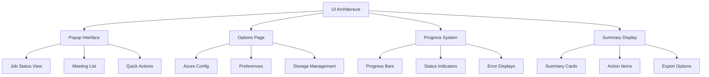

# ui-architecture - Task 27

Execute task 27 for the ui-architecture specification.

## Task Description
Create progress monitor hook in packages/ui/lib/hooks/useProgressMonitor.ts

## Code Reuse
**Leverage existing code**: packages/shared/lib/hooks background communication

## Requirements Reference
**Requirements**: 3.1, 3.2, 3.3, 3.4

## Usage
```
/Task:27-ui-architecture
```

## Instructions

Execute with @spec-task-executor agent the following task: "Create progress monitor hook in packages/ui/lib/hooks/useProgressMonitor.ts"

```
Use the @spec-task-executor agent to implement task 27: "Create progress monitor hook in packages/ui/lib/hooks/useProgressMonitor.ts" for the ui-architecture specification and include all the below context.

# Steering Context
## Steering Documents Context

No steering documents found or all are empty.

# Specification Context
## Specification Context (Pre-loaded): ui-architecture

### Requirements
# Requirements Document

## Introduction

The UI Architecture provides the complete user interface system for the Meeting Summarizer extension, built on React 19.1.1 with TypeScript and Tailwind CSS. This system includes the popup interface, options page, progress indicators, meeting summary displays, and responsive design components that create a cohesive user experience.

## Alignment with Product Vision

This UI architecture directly supports the product vision by:
- **Professional Interface**: Provides enterprise-grade UI suitable for corporate environments
- **Intuitive Workflow**: Creates seamless user experience from transcription initiation to summary review
- **Quick Access**: Enables rapid access to meeting summaries and action items through popup interface
- **Configuration Management**: Provides comprehensive Azure API and preference management

## Requirements

### Requirement 1: Extension Popup Interface

**User Story:** As a user, I want a comprehensive popup interface that shows transcription status, recent meetings, and quick access to summaries, so that I can manage my meeting transcriptions efficiently.

#### Acceptance Criteria

1. WHEN opening the popup THEN the system SHALL display current transcription jobs with progress indicators and estimated completion times
2. WHEN viewing recent meetings THEN the system SHALL show a chronological list with meeting titles, dates, and transcription status
3. WHEN accessing summaries THEN the system SHALL provide quick preview with expand options for full summaries and action items
4. WHEN managing jobs THEN the system SHALL provide controls to pause, resume, or cancel active transcription jobs

### Requirement 2: Comprehensive Options Page

**User Story:** As a user, I want a detailed options page where I can configure Azure API settings, manage preferences, and control extension behavior, so that I can customize the extension for my needs.

#### Acceptance Criteria

1. WHEN configuring Azure API THEN the system SHALL provide secure input fields for subscription key, region, and language preferences
2. WHEN managing storage THEN the system SHALL display storage usage statistics and provide cleanup options
3. WHEN setting preferences THEN the system SHALL offer options for auto-transcription, notification settings, and summary formats
4. WHEN testing configuration THEN the system SHALL provide validation tools to verify Azure API connectivity and settings

### Requirement 3: Progress Monitoring System

**User Story:** As a user, I want clear visual feedback about transcription progress and system status, so that I understand what the extension is doing and when it will complete.

#### Acceptance Criteria

1. WHEN jobs are running THEN the system SHALL display real-time progress bars with percentage completion and time estimates
2. WHEN multiple jobs are active THEN the system SHALL show individual progress for each transcription with clear identification
3. WHEN errors occur THEN the system SHALL display specific error messages with suggested resolution actions
4. WHEN jobs complete THEN the system SHALL show completion notifications with summary preview options

### Requirement 4: Meeting Summary Display

**User Story:** As a user, I want well-organized displays of meeting summaries, action items, and key decisions, so that I can quickly review and act on meeting outcomes.

#### Acceptance Criteria

1. WHEN displaying summaries THEN the system SHALL organize content into sections for overview, key points, action items, and decisions
2. WHEN showing action items THEN the system SHALL highlight assigned parties, deadlines, and priority levels with visual indicators
3. WHEN presenting transcriptions THEN the system SHALL provide searchable, scrollable text with speaker identification and timestamps
4. WHEN exporting content THEN the system SHALL support multiple formats including text, structured data, and printable summaries

### Requirement 5: Responsive Design System

**User Story:** As a user, I want consistent visual design that works well across different screen sizes and interface contexts, so that the extension looks professional and functions properly everywhere.

#### Acceptance Criteria

1. WHEN rendering in popup context THEN the system SHALL optimize layout for the constrained popup dimensions (400px width)
2. WHEN displaying options page THEN the system SHALL use full page layout with proper spacing and navigation
3. WHEN injecting into content pages THEN the system SHALL provide compact, non-intrusive UI elements that adapt to page themes
4. WHEN supporting accessibility THEN the system SHALL provide proper ARIA labels, keyboard navigation, and screen reader compatibility

## Non-Functional Requirements

### Performance
- Component rendering SHALL complete within 200ms for initial load
- UI updates SHALL respond within 50ms to user interactions
- Progress updates SHALL refresh smoothly without flickering or layout shifts
- Memory usage SHALL remain under 30MB for all UI components combined

### Security
- User input SHALL be properly sanitized to prevent XSS vulnerabilities
- API keys SHALL be masked in UI with reveal options for verification
- External links SHALL be properly validated before opening
- Sensitive information SHALL never be logged or exposed in DOM

### Reliability
- UI SHALL gracefully handle missing or corrupted meeting data
- Components SHALL recover from render errors without crashing the entire interface
- State management SHALL persist across popup open/close cycles
- System SHALL work consistently across supported browser versions

### Usability
- Interface SHALL follow modern design principles with clear visual hierarchy
- Loading states SHALL provide meaningful feedback during operations
- Error messages SHALL be user-friendly with actionable guidance
- Navigation SHALL be intuitive with clear information architecture

---

### Design
# Design Document

## Overview

The UI Architecture design provides a comprehensive React-based user interface system for the Meeting Summarizer extension, implementing responsive design principles with TypeScript and Tailwind CSS. This system includes popup interfaces, options pages, progress monitoring, and meeting summary displays that create a cohesive and professional user experience.

## Steering Document Alignment

### Technical Standards (tech.md)
- **React Framework**: Uses documented React 19.1.1 with TypeScript for component development
- **Styling System**: Implements documented Tailwind CSS 3.4.17 integration patterns
- **State Management**: Follows documented React hooks with Chrome Storage API integration
- **UI Components**: Builds upon documented packages/ui component library

### Project Structure (structure.md)
- **Component Organization**: Follows documented PascalCase naming and component directory structure
- **Page Structure**: Extends documented pages/ organization for popup and options interfaces
- **Styling Configuration**: Uses documented Tailwind configuration hierarchy
- **Import Patterns**: Implements documented absolute imports and barrel exports

## Code Reuse Analysis

### Existing Components to Leverage
- **UI Package Components**: Extend packages/ui/lib/components with meeting-specific interfaces
- **Popup Structure**: Build upon pages/popup/src existing React application structure
- **Options Structure**: Extend pages/options/src with meeting configuration interfaces
- **Shared Hooks**: Use packages/shared/lib/hooks for storage integration and state management

### Integration Points
- **Background Service**: Integrate with Service Worker for real-time job status updates
- **Storage System**: Connect with enhanced storage for meeting data and configuration access
- **Content Scripts**: Coordinate with injected UI elements for consistent user experience
- **Azure Integration**: Provide configuration interfaces for Azure Speech API setup

## Architecture



## Components and Interfaces

### PopupInterface
- **Purpose:** Provides comprehensive meeting management interface within extension popup constraints
- **Interfaces:** Display active jobs, show recent meetings, provide quick actions, handle navigation
- **Dependencies:** Background service communication, storage access, React routing
- **Reuses:** Existing popup structure, UI components, background communication patterns

### OptionsPage
- **Purpose:** Comprehensive configuration interface for Azure setup, preferences, and storage management
- **Interfaces:** Configure Azure API, manage preferences, handle storage operations, provide testing tools
- **Dependencies:** Secure configuration storage, validation utilities, Azure API testing
- **Reuses:** Existing options page structure, form components, validation patterns

### ProgressMonitoringSystem
- **Purpose:** Real-time progress display system with error handling and status communication
- **Interfaces:** Display progress, show status updates, handle errors, provide user feedback
- **Dependencies:** Background service events, progress calculation utilities, error classification
- **Reuses:** Existing UI components, event handling patterns, error display components

### MeetingSummaryDisplay
- **Purpose:** Organized display of meeting summaries, action items, and transcription results
- **Interfaces:** Render summaries, display action items, provide search/filter, handle exports
- **Dependencies:** Meeting processing results, export utilities, search functionality
- **Reuses:** Existing UI components, data display patterns, export utilities

## Data Models

### PopupState
```typescript
interface PopupState {
  activeJobs: TranscriptionJob[];
  recentMeetings: MeetingRecord[];
  currentView: 'jobs' | 'meetings' | 'settings';
  connectionStatus: 'connected' | 'disconnected' | 'error';
  lastUpdate: Date;
  userPreferences: UIPreferences;
}
```

### OptionsPageState
```typescript
interface OptionsPageState {
  azureConfig: AzureSpeechConfig;
  isConfigValid: boolean;
  testResults?: ConfigTestResult;
  storageStats: StorageStatistics;
  userPreferences: UserPreferences;
  isDirty: boolean;
  validationErrors: ValidationError[];
}
```

### ProgressDisplayState
```typescript
interface ProgressDisplayState {
  jobProgress: Map<string, JobProgress>;
  overallStatus: 'idle' | 'processing' | 'paused' | 'error';
  estimatedCompletion?: Date;
  errorStates: Map<string, ErrorState>;
  notificationQueue: Notification[];
}
```

## Error Handling

### Error Scenarios
1. **Background Service Connection Loss**
   - **Handling:** Connection monitoring, reconnection attempts, cached state display
   - **User Impact:** Connection status indicator with automatic retry

2. **Configuration Validation Errors**
   - **Handling:** Real-time validation, specific error messages, guided correction
   - **User Impact:** Inline error messages with actionable correction guidance

3. **UI Rendering Errors**
   - **Handling:** Error boundaries, graceful degradation, component isolation
   - **User Impact:** Partial UI functionality with error reporting option

4. **Data Loading Failures**
   - **Handling:** Loading states, retry mechanisms, fallback content
   - **User Impact:** Loading indicators with retry options for failed operations

## Testing Strategy

### Unit Testing
- Test React components with various props and state configurations
- Test UI state management with different user interaction scenarios
- Test error boundaries and error handling with component failure simulation
- Test responsive design with different viewport sizes and configurations

### Integration Testing
- Test integration with background service for real-time updates
- Test storage integration for configuration and meeting data access
- Test cross-component communication and state synchronization
- Test accessibility features with screen reader and keyboard navigation

### End-to-End Testing
- Test complete user workflows from configuration to meeting summary review
- Test popup interface behavior with various job states and meeting data
- Test options page functionality with configuration changes and validation
- Test responsive behavior across different browser window sizes and orientations

**Note**: Specification documents have been pre-loaded. Do not use get-content to fetch them again.

## Task Details
- Task ID: 27
- Description: Create progress monitor hook in packages/ui/lib/hooks/useProgressMonitor.ts
- Leverage: packages/shared/lib/hooks background communication
- Requirements: 3.1, 3.2, 3.3, 3.4

## Instructions
- Implement ONLY task 27: "Create progress monitor hook in packages/ui/lib/hooks/useProgressMonitor.ts"
- Follow all project conventions and leverage existing code
- Mark the task as complete using: claude-code-spec-workflow get-tasks ui-architecture 27 --mode complete
- Provide a completion summary
```

## Task Completion
When the task is complete, mark it as done:
```bash
claude-code-spec-workflow get-tasks ui-architecture 27 --mode complete
```

## Next Steps
After task completion, you can:
- Execute the next task using /ui-architecture-task-[next-id]
- Check overall progress with /spec-status ui-architecture
