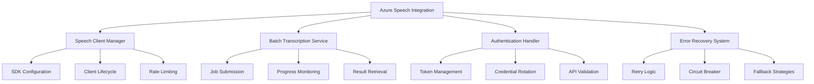

# Design Document

## Overview

The Azure Speech Integration design provides robust integration with Azure Cognitive Services Speech SDK, implementing direct URL processing for SharePoint meeting recordings. This system handles batch transcription, authentication management, error recovery, and multi-language support while maintaining enterprise-grade reliability and security.

## Steering Document Alignment

### Technical Standards (tech.md)
- **Azure Integration**: Implements documented Azure Speech SDK integration patterns
- **API Configuration**: Follows documented AzureSpeechConfig interface specifications
- **Processing Workflow**: Adheres to documented batch transcription processing pipeline
- **Security Standards**: Implements secure API key management and encrypted storage

### Project Structure (structure.md)
- **Package Organization**: Creates packages/azure-speech for Speech SDK integration
- **Service Layer**: Follows documented service layer patterns for external API integration
- **Error Handling**: Implements documented error handling and retry strategies
- **Type Definitions**: Uses documented type organization for API-related interfaces

## Code Reuse Analysis

### Existing Components to Leverage
- **Storage Configuration**: Integrate with storage system for secure credential management
- **Background Service**: Coordinate with Service Worker for job orchestration
- **Shared Utilities**: Use packages/shared/lib/utils for error handling and logging
- **Type System**: Build upon foundation layer Azure-specific type definitions

### Integration Points
- **Chrome Storage**: Secure retrieval of encrypted Azure credentials
- **Background Jobs**: Integration with transcription job queue management
- **Content Detection**: Receive audio URLs from SharePoint/Teams detection
- **Meeting Processing**: Provide transcription results for AI summarization

## Architecture



## Components and Interfaces

### SpeechClientManager
- **Purpose:** Manages Azure Speech SDK client lifecycle, configuration, and connection management
- **Interfaces:** Initialize client, configure recognition, manage authentication, handle client disposal
- **Dependencies:** Azure Speech SDK, storage configuration, credential management
- **Reuses:** Configuration patterns, service initialization utilities

### BatchTranscriptionService
- **Purpose:** Handles Azure batch transcription jobs with URL input, progress tracking, and result processing
- **Interfaces:** Submit jobs, monitor progress, retrieve results, cancel jobs, handle failures
- **Dependencies:** Speech Client Manager, job queue system, result caching
- **Reuses:** Background job patterns, status tracking utilities

### AuthenticationHandler
- **Purpose:** Manages Azure API authentication, token lifecycle, and credential security
- **Interfaces:** Authenticate, refresh tokens, validate credentials, handle auth errors
- **Dependencies:** Secure storage, encryption utilities, Azure authentication APIs
- **Reuses:** Secure credential storage patterns, token management utilities

### ErrorRecoverySystem
- **Purpose:** Implements comprehensive error handling, retry logic, and resilience patterns
- **Interfaces:** Retry operations, circuit breaking, fallback execution, error classification
- **Dependencies:** Logging utilities, exponential backoff implementation, error categorization
- **Reuses:** Existing error handling patterns, retry utilities

## Data Models

### TranscriptionJob
```typescript
interface TranscriptionJob {
  jobId: string; // Unique job identifier
  audioUrl: string; // SharePoint audio URL
  azureJobId?: string; // Azure batch transcription job ID
  status: 'pending' | 'submitted' | 'processing' | 'completed' | 'failed';
  progress: number; // 0-100 completion percentage
  submittedAt: Date;
  completedAt?: Date;
  config: TranscriptionConfig;
  retryCount: number;
  lastError?: TranscriptionError;
}
```

### TranscriptionConfig
```typescript
interface TranscriptionConfig {
  language: string; // Primary language code
  enableSpeakerDiarization: boolean;
  enableProfanityFilter: boolean;
  outputFormat: 'detailed' | 'simple';
  confidenceThreshold: number; // 0.0-1.0
  maxSpeakers?: number; // For diarization
  customVocabulary?: string[]; // Domain-specific terms
}
```

### TranscriptionResult
```typescript
interface TranscriptionResult {
  jobId: string;
  text: string; // Complete transcription text
  confidence: number; // Overall confidence score
  duration: number; // Audio duration in seconds
  speakers?: SpeakerInfo[]; // Speaker diarization results
  segments: TranscriptionSegment[]; // Time-aligned segments
  metadata: {
    audioFormat: string;
    sampleRate: number;
    channels: number;
    processingTime: number;
  };
}
```

## Error Handling

### Error Scenarios
1. **Authentication Failure**
   - **Handling:** Token refresh attempt, credential validation, user re-authentication prompt
   - **User Impact:** Clear messaging about API key issues with setup guidance

2. **Rate Limit Exceeded**
   - **Handling:** Exponential backoff, job queuing, quota monitoring, user notification
   - **User Impact:** Progress indication with estimated retry time

3. **Invalid Audio URL**
   - **Handling:** URL validation, format checking, accessibility testing, fallback options
   - **User Impact:** Specific error message with troubleshooting suggestions

4. **Service Outage**
   - **Handling:** Circuit breaker activation, service health monitoring, automatic retry scheduling
   - **User Impact:** Service status indication with estimated recovery time

## Testing Strategy

### Unit Testing
- Test Speech SDK client initialization and configuration
- Test authentication and token management workflows
- Test error handling and retry logic with various failure scenarios
- Test transcription job lifecycle management

### Integration Testing
- Test end-to-end transcription workflow with mock Azure services
- Test integration with storage system for credential management
- Test background service coordination for job processing
- Test multi-language support with various audio samples

### End-to-End Testing
- Test complete workflow from SharePoint URL to transcription result
- Test error recovery scenarios with real Azure service interactions
- Test performance with large audio files and concurrent jobs
- Test cross-browser compatibility with Azure SDK dependencies