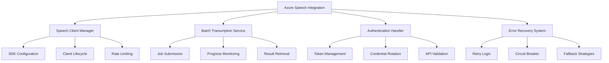

# Design Document

## Overview

The Azure Speech Integration design provides robust integration with Azure Cognitive Services Speech SDK, implementing direct URL processing for SharePoint meeting recordings. This system handles batch transcription, authentication management, error recovery, and multi-language support while maintaining enterprise-grade reliability and security.

**Current Status**: Foundation layer complete with comprehensive type system, client management infrastructure, and UI components. Core services implemented as stub interfaces ready for gradual Azure SDK integration.

## Steering Document Alignment

### Technical Standards (tech.md)
- **Azure Integration**: Implements documented Azure Speech SDK integration patterns
- **API Configuration**: Follows documented AzureSpeechConfig interface specifications
- **Processing Workflow**: Adheres to documented batch transcription processing pipeline
- **Security Standards**: Implements secure API key management and encrypted storage

### Project Structure (structure.md)
- **Package Organization**: Creates packages/azure-speech for Speech SDK integration
- **Service Layer**: Follows documented service layer patterns for external API integration
- **Error Handling**: Implements documented error handling and retry strategies
- **Type Definitions**: Uses documented type organization for API-related interfaces

## Code Reuse Analysis

### Existing Components to Leverage
- **Storage Configuration**: Integrate with storage system for secure credential management
- **Background Service**: Coordinate with Service Worker for job orchestration
- **Shared Utilities**: Use packages/shared/lib/utils for error handling and logging
- **Type System**: Build upon foundation layer Azure-specific type definitions

### Integration Points
- **Chrome Storage**: Secure retrieval of encrypted Azure credentials
- **Background Jobs**: Integration with transcription job queue management
- **Content Detection**: Receive audio URLs from SharePoint/Teams detection
- **Meeting Processing**: Provide transcription results for AI summarization

## Architecture



## Components and Interfaces

### SpeechClientManager ✅ IMPLEMENTED
- **Purpose:** Manages Azure Speech SDK client lifecycle, configuration, and connection management
- **Interfaces:** Initialize client, configure recognition, manage authentication, handle client disposal
- **Dependencies:** Azure Speech SDK, storage configuration, credential management
- **Reuses:** Configuration patterns, service initialization utilities
- **Status:** Complete implementation with client factory, rate limiting, and health monitoring

### SpeechClientFactory ✅ IMPLEMENTED  
- **Purpose:** Creates and manages Azure Speech SDK client instances with lifecycle management
- **Interfaces:** Create clients, dispose resources, track active clients, generate client IDs
- **Dependencies:** Azure Speech configuration, event management, connection simulation
- **Status:** Complete implementation with stub Azure SDK integration ready for real SDK

### SpeechConfigBuilder ✅ IMPLEMENTED
- **Purpose:** Builds Azure Speech SDK configuration with validation and language support
- **Interfaces:** Configure subscription, region, language, endpoints, transcription settings
- **Dependencies:** Azure region mapping, language presets, configuration validation
- **Status:** Complete implementation with comprehensive configuration options

### RateLimiter ✅ IMPLEMENTED
- **Purpose:** Implements API rate limiting and quota management for Azure Speech API
- **Interfaces:** Allow requests, track quotas, manage concurrent limits, exponential backoff
- **Dependencies:** Request tracking, quota monitoring, circuit breaker patterns
- **Status:** Complete implementation with comprehensive rate limiting strategies

### BatchTranscriptionService 🔄 STUB INTERFACE
- **Purpose:** Handles Azure batch transcription jobs with URL input, progress tracking, and result processing
- **Interfaces:** Submit jobs, monitor progress, retrieve results, cancel jobs, handle failures
- **Dependencies:** Speech Client Manager, job queue system, result caching
- **Reuses:** Background job patterns, status tracking utilities
- **Status:** Stub implementation ready for Azure SDK integration

### AuthenticationHandler 🔄 STUB INTERFACE
- **Purpose:** Manages Azure API authentication, token lifecycle, and credential security
- **Interfaces:** Authenticate, refresh tokens, validate credentials, handle auth errors
- **Dependencies:** Secure storage, encryption utilities, Azure authentication APIs
- **Reuses:** Secure credential storage patterns, token management utilities
- **Status:** Stub implementation with basic interface structure

### ErrorRecoverySystem 🔄 STUB INTERFACE
- **Purpose:** Implements comprehensive error handling, retry logic, and resilience patterns
- **Interfaces:** Retry operations, circuit breaking, fallback execution, error classification
- **Dependencies:** Logging utilities, exponential backoff implementation, error categorization
- **Reuses:** Existing error handling patterns, retry utilities
- **Status:** Stub implementation with comprehensive error type definitions

### AzureConfigForm ✅ IMPLEMENTED
- **Purpose:** Provides user interface for Azure Speech configuration and credential management
- **Interfaces:** Configuration form, validation, save/load settings, connection testing
- **Dependencies:** React components, form validation, secure storage integration
- **Status:** Complete implementation with validation and testing capabilities

### AzureConnectionTester ✅ IMPLEMENTED
- **Purpose:** Tests Azure Speech service connectivity and validates configuration
- **Interfaces:** Connection testing, service validation, status reporting, error diagnostics
- **Dependencies:** Azure configuration, service health checking, user feedback
- **Status:** Complete implementation with comprehensive testing capabilities

## Data Models

### TranscriptionJob
```typescript
interface TranscriptionJob {
  jobId: string; // Unique job identifier
  audioUrl: string; // SharePoint audio URL
  azureJobId?: string; // Azure batch transcription job ID
  status: 'pending' | 'submitted' | 'processing' | 'completed' | 'failed';
  progress: number; // 0-100 completion percentage
  submittedAt: Date;
  completedAt?: Date;
  config: TranscriptionConfig;
  retryCount: number;
  lastError?: TranscriptionError;
}
```

### TranscriptionConfig
```typescript
interface TranscriptionConfig {
  language: string; // Primary language code
  enableSpeakerDiarization: boolean;
  enableProfanityFilter: boolean;
  outputFormat: 'detailed' | 'simple';
  confidenceThreshold: number; // 0.0-1.0
  maxSpeakers?: number; // For diarization
  customVocabulary?: string[]; // Domain-specific terms
}
```

### TranscriptionResult
```typescript
interface TranscriptionResult {
  jobId: string;
  text: string; // Complete transcription text
  confidence: number; // Overall confidence score
  duration: number; // Audio duration in seconds
  speakers?: SpeakerInfo[]; // Speaker diarization results
  segments: TranscriptionSegment[]; // Time-aligned segments
  metadata: {
    audioFormat: string;
    sampleRate: number;
    channels: number;
    processingTime: number;
  };
}
```

## Error Handling

### Error Scenarios
1. **Authentication Failure**
   - **Handling:** Token refresh attempt, credential validation, user re-authentication prompt
   - **User Impact:** Clear messaging about API key issues with setup guidance

2. **Rate Limit Exceeded**
   - **Handling:** Exponential backoff, job queuing, quota monitoring, user notification
   - **User Impact:** Progress indication with estimated retry time

3. **Invalid Audio URL**
   - **Handling:** URL validation, format checking, accessibility testing, fallback options
   - **User Impact:** Specific error message with troubleshooting suggestions

4. **Service Outage**
   - **Handling:** Circuit breaker activation, service health monitoring, automatic retry scheduling
   - **User Impact:** Service status indication with estimated recovery time

## Testing Strategy

### Unit Testing
- Test Speech SDK client initialization and configuration
- Test authentication and token management workflows
- Test error handling and retry logic with various failure scenarios
- Test transcription job lifecycle management

### Integration Testing
- Test end-to-end transcription workflow with mock Azure services
- Test integration with storage system for credential management
- Test background service coordination for job processing
- Test multi-language support with various audio samples

### End-to-End Testing
- Test complete workflow from SharePoint URL to transcription result
- Test error recovery scenarios with real Azure service interactions
- Test performance with large audio files and concurrent jobs
- Test cross-browser compatibility with Azure SDK dependencies

## Implementation Status

### ✅ Foundation Layer Complete
The Azure Speech integration foundation has been successfully implemented with:

**Core Infrastructure**:
- Complete type system for Azure Speech API (40+ interfaces and types)
- Speech client factory with lifecycle management
- Configuration builder with validation and language support
- Rate limiter with quota management and circuit breaker patterns
- Comprehensive error type definitions with recovery strategies

**Integration Support**:
- Updated shared package types for cross-package compatibility
- Storage schema updates for Azure configuration persistence
- Build configuration updates for package compilation
- UI components for Azure Speech setup and testing

**Development Architecture**:
- Stub implementations for all core services maintaining interface contracts
- Ready for gradual Azure SDK integration without breaking existing code
- Comprehensive documentation and specifications for future development

### 🔄 Ready for Azure SDK Integration
The foundation provides:
- Complete interface definitions matching Azure Speech API patterns
- Stub implementations that can be gradually replaced with real Azure SDK calls
- Error handling and recovery infrastructure ready for production use
- UI components ready for real Azure Speech service integration

**Next Steps**: Replace stub implementations with actual Azure Speech SDK calls while maintaining existing interfaces and error handling patterns.