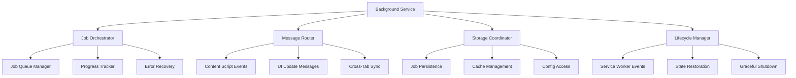

# Design Document

## Overview

The Background Service Architecture design provides the central orchestration layer using Chrome Extension Manifest v3 Service Worker. This system coordinates transcription jobs, manages cross-component communication, handles storage operations, and serves as the reliable backbone for all extension functionality.

## Steering Document Alignment

### Technical Standards (tech.md)
- **Service Worker Architecture**: Implements documented background service worker responsibilities
- **Cross-Tab Communication**: Follows documented communication patterns and message routing
- **Storage Coordination**: Adheres to documented storage management and caching strategies
- **API Integration**: Coordinates Azure API calls following documented patterns

### Project Structure (structure.md)
- **Background Script Organization**: Extends chrome-extension/src/background structure
- **Service Layer**: Implements documented application service patterns
- **Message Handling**: Follows documented inter-component communication conventions
- **Error Handling**: Uses documented error handling and recovery strategies

## Code Reuse Analysis

### Existing Components to Leverage
- **Background Index**: Extend chrome-extension/src/background/index.ts with meeting orchestration
- **Storage Services**: Integrate with enhanced storage system for job persistence
- **Shared Utilities**: Use packages/shared/lib/utils for logging and error handling
- **HMR Integration**: Leverage packages/hmr for development workflow support

### Integration Points
- **Azure Speech Integration**: Coordinate transcription job execution and monitoring
- **Content Scripts**: Handle detection events and UI update coordination
- **Storage System**: Manage job persistence, caching, and configuration access
- **UI Components**: Provide real-time updates to popup and options interfaces

## Architecture



## Components and Interfaces

### JobOrchestrator
- **Purpose:** Manages transcription job lifecycle from creation to completion with reliable execution
- **Interfaces:** Create jobs, execute transcription, monitor progress, handle completion/failure
- **Dependencies:** Azure Speech Integration, storage system, progress tracking utilities
- **Reuses:** Existing background service patterns, job queue management utilities

### MessageRouter
- **Purpose:** Handles all inter-component communication with proper routing and conflict resolution
- **Interfaces:** Route messages, broadcast updates, handle responses, manage subscriptions
- **Dependencies:** Chrome Extension messaging APIs, component registry, message validation
- **Reuses:** Existing message passing patterns, event handling utilities

### StorageCoordinator
- **Purpose:** Coordinates all storage operations ensuring consistency and performance across components
- **Interfaces:** Coordinate storage, manage transactions, handle conflicts, optimize performance
- **Dependencies:** Enhanced storage system, cache management, quota monitoring
- **Reuses:** Existing storage coordination patterns, transaction management

### LifecycleManager
- **Purpose:** Manages Service Worker lifecycle ensuring reliable operation across browser sessions
- **Interfaces:** Handle startup/shutdown, restore state, manage persistence, coordinate suspension
- **Dependencies:** Chrome Extension lifecycle APIs, state serialization, job persistence
- **Reuses:** Existing Service Worker patterns, state management utilities

## Data Models

### JobOrchestrationState
```typescript
interface JobOrchestrationState {
  activeJobs: Map<string, TranscriptionJob>;
  jobQueue: PriorityQueue<TranscriptionJob>;
  completedJobs: Map<string, JobResult>;
  erroredJobs: Map<string, JobError>;
  systemStatus: 'idle' | 'processing' | 'paused' | 'error';
  lastStateUpdate: Date;
  resourceLimits: ResourceLimits;
}
```

### MessageRouterConfig
```typescript
interface MessageRouterConfig {
  subscribedComponents: Map<string, ComponentInfo>;
  messageTypes: Map<string, MessageHandler>;
  broadcastChannels: Set<string>;
  routingRules: RoutingRule[];
  rateLimits: Map<string, RateLimit>;
  errorHandlers: Map<string, ErrorHandler>;
}
```

### ServiceWorkerState
```typescript
interface ServiceWorkerState {
  startupTime: Date;
  lastHeartbeat: Date;
  suspensionCount: number;
  restoredJobs: number;
  activeConnections: Map<string, Connection>;
  performanceMetrics: PerformanceMetrics;
  errorLog: ErrorEntry[];
  configVersion: string;
}
```

## Error Handling

### Error Scenarios
1. **Service Worker Termination**
   - **Handling:** Automatic state persistence, job queue preservation, graceful restoration
   - **User Impact:** Brief pause in processing with automatic resume

2. **Job Processing Failure**
   - **Handling:** Error categorization, retry logic, user notification, fallback options
   - **User Impact:** Clear error messages with retry options and troubleshooting guidance

3. **Communication Breakdown**
   - **Handling:** Connection monitoring, automatic reconnection, message queuing, timeout handling
   - **User Impact:** Temporary UI inconsistency with automatic synchronization

4. **Resource Exhaustion**
   - **Handling:** Resource monitoring, intelligent queuing, cleanup procedures, user notification
   - **User Impact:** Performance degradation warning with optimization suggestions

## Testing Strategy

### Unit Testing
- Test job orchestration with various job types and completion scenarios
- Test message routing with complex component interaction patterns
- Test storage coordination with concurrent access and conflict scenarios
- Test lifecycle management with Service Worker suspension and restoration

### Integration Testing
- Test integration with Azure Speech services for end-to-end job processing
- Test coordination with content scripts for detection and UI updates
- Test storage system integration for job persistence and caching
- Test cross-component communication under various load conditions

### End-to-End Testing
- Test complete transcription workflow from detection to summary generation
- Test Service Worker resilience with browser restarts and extension updates
- Test multi-tab coordination with simultaneous transcription requests
- Test error recovery scenarios with various failure conditions