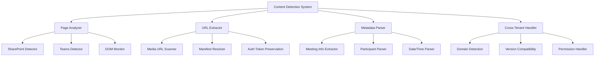

# Design Document

## Overview

The Content Detection System design provides intelligent recognition of SharePoint and Teams pages containing meeting recordings, with robust URL extraction and metadata parsing capabilities. This system serves as the entry point for transcription workflows, implementing cross-tenant compatibility and resilient page analysis.

## Steering Document Alignment

### Technical Standards (tech.md)
- **Content Script Architecture**: Follows documented content script responsibilities and patterns
- **SharePoint Integration**: Implements documented SharePoint URL extraction strategies
- **Cross-Browser Support**: Adheres to content script compatibility requirements
- **Security Standards**: Implements safe DOM analysis without external resource injection

### Project Structure (structure.md)
- **Package Organization**: Creates packages/meeting-parser for content detection services
- **Content Scripts**: Follows documented content script organization in pages/content
- **Service Layer**: Implements detection services following documented patterns
- **Type Definitions**: Uses documented type organization for detection-related interfaces

## Code Reuse Analysis

### Existing Components to Leverage
- **Content Script Base**: Build upon pages/content/src existing structure and patterns
- **DOM Utilities**: Extend packages/shared/lib/utils with DOM manipulation helpers
- **Background Communication**: Use existing message passing patterns for Service Worker coordination
- **URL Validation**: Leverage shared URL utilities and validation functions

### Integration Points
- **Background Service**: Send detection events to Service Worker for processing
- **Azure Integration**: Provide extracted URLs to transcription services
- **Storage System**: Cache detection results and page metadata
- **UI Components**: Trigger content script UI injection for detected meetings

## Architecture



## Components and Interfaces

### PageAnalyzer
- **Purpose:** Detects SharePoint/Teams pages and identifies meeting content availability
- **Interfaces:** Analyze page, detect content type, monitor changes, validate context
- **Dependencies:** DOM APIs, URL analysis utilities, content type detection
- **Reuses:** Existing content script patterns, DOM utility functions

### URLExtractor
- **Purpose:** Extracts direct media URLs from SharePoint/Teams pages with authentication preservation
- **Interfaces:** Extract URLs, resolve manifests, validate accessibility, preserve tokens
- **Dependencies:** URL parsing utilities, authentication token handling, format validation
- **Reuses:** Shared URL utilities, security validation patterns

### MetadataParser
- **Purpose:** Extracts meeting metadata including title, participants, dates, and agenda information
- **Interfaces:** Parse metadata, extract participants, identify topics, format structured data
- **Dependencies:** DOM parsing utilities, date parsing libraries, text extraction tools
- **Reuses:** Shared parsing utilities, data formatting functions

### CrossTenantHandler
- **Purpose:** Handles different SharePoint configurations, versions, and tenant-specific variations
- **Interfaces:** Detect tenant type, adapt parsing strategies, handle permissions, provide fallbacks
- **Dependencies:** Domain analysis, version detection, permission checking APIs
- **Reuses:** Compatibility utilities, feature detection patterns

## Data Models

### MeetingDetection
```typescript
interface MeetingDetection {
  pageType: 'sharepoint' | 'teams' | 'unknown';
  meetingId: string; // Derived from URL or page metadata
  audioUrls: AudioUrlInfo[];
  metadata: MeetingMetadata;
  confidence: number; // Detection confidence 0.0-1.0
  detectedAt: Date;
  pageUrl: string;
  tenantInfo?: TenantInfo;
}
```

### AudioUrlInfo
```typescript
interface AudioUrlInfo {
  url: string; // Direct media URL
  format: 'mp4' | 'wav' | 'mp3' | 'manifest';
  duration?: number; // Duration in seconds if available
  size?: number; // File size in bytes if available
  quality: 'high' | 'medium' | 'low' | 'unknown';
  requiresAuth: boolean; // Whether authentication is needed
  authTokens?: Record<string, string>; // Preserved auth tokens
}
```

### MeetingMetadata
```typescript
interface MeetingMetadata {
  title: string;
  organizer?: string;
  startTime?: Date;
  endTime?: Date;
  participants: string[];
  description?: string;
  topics?: string[];
  channel?: string; // Teams channel if applicable
  recordingDate?: Date;
  recordingDuration?: number;
}
```

## Error Handling

### Error Scenarios
1. **Page Structure Changes**
   - **Handling:** Multiple detection strategies, graceful degradation, fallback selectors
   - **User Impact:** May show "content not found" with option to retry

2. **Authentication Required**
   - **Handling:** Detect auth requirements, preserve existing tokens, guide user login
   - **User Impact:** Clear messaging about access requirements

3. **Cross-Domain Restrictions**
   - **Handling:** Respect CORS policies, use alternative detection methods, provide user guidance
   - **User Impact:** Limited functionality with explanation of restrictions

4. **Malformed Page Content**
   - **Handling:** Robust parsing with error tolerance, partial data extraction, validation
   - **User Impact:** Partial detection results with confidence indicators

## Testing Strategy

### Unit Testing
- Test page detection with various SharePoint/Teams page structures
- Test URL extraction with different media formats and authentication states
- Test metadata parsing with diverse meeting information formats
- Test cross-tenant compatibility with simulated different configurations

### Integration Testing
- Test integration with background service for detection event handling
- Test coordination with Azure integration for URL processing
- Test storage integration for caching detection results
- Test UI integration for content script injection

### End-to-End Testing
- Test complete detection workflow on real SharePoint/Teams pages
- Test cross-browser compatibility with different tenant configurations
- Test error handling with inaccessible or protected content
- Test performance with pages containing multiple meeting recordings