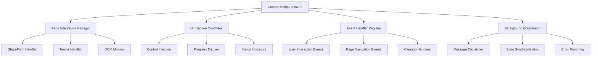

# Design Document

## Overview

The Content Scripts System design provides seamless browser-side integration within SharePoint and Teams pages, implementing DOM manipulation, UI injection, and event handling. This system creates the bridge between webpage content and extension functionality while maintaining compatibility across different page layouts and browser environments.

## Steering Document Alignment

### Technical Standards (tech.md)
- **Content Script Architecture**: Implements documented content script responsibilities for page integration
- **DOM Manipulation**: Follows safe DOM injection practices without external resource dependencies
- **Cross-Browser Support**: Adheres to documented cross-browser compatibility requirements
- **UI Integration**: Implements documented UI injection patterns with proper cleanup

### Project Structure (structure.md)
- **Content Scripts Organization**: Extends pages/content structure with SharePoint/Teams specific handlers
- **Component Integration**: Follows documented UI component integration patterns
- **Event Handling**: Implements documented event handling and cleanup procedures
- **Message Passing**: Uses documented background service communication patterns

## Code Reuse Analysis

### Existing Components to Leverage
- **Content Base Structure**: Build upon pages/content/src existing architecture and patterns
- **UI Components**: Integrate packages/ui components for consistent extension interface
- **Shared Utilities**: Use packages/shared/lib/utils for DOM manipulation and event handling
- **HMR Support**: Leverage existing HMR integration for development workflow

### Integration Points
- **Background Service**: Send user actions and receive status updates via message passing
- **Content Detection**: Coordinate with detection services for context-aware feature activation
- **UI Architecture**: Inject React components for meeting controls and progress displays
- **Storage System**: Access meeting data for display and user interaction

## Architecture



## Components and Interfaces

### PageIntegrationManager
- **Purpose:** Manages context-aware integration with SharePoint/Teams pages based on content and layout
- **Interfaces:** Initialize integration, adapt to page changes, manage feature visibility, handle cleanup
- **Dependencies:** Content detection results, page layout analysis, feature flag management
- **Reuses:** Existing content script initialization patterns, page monitoring utilities

### UIInjectionController
- **Purpose:** Handles safe injection of React components and controls into host pages with proper styling
- **Interfaces:** Inject components, manage styling, handle updates, coordinate removal
- **Dependencies:** React rendering utilities, CSS isolation, component lifecycle management
- **Reuses:** packages/ui components, existing UI injection patterns

### EventHandlerRegistry
- **Purpose:** Manages all event handlers with proper cleanup and memory leak prevention
- **Interfaces:** Register handlers, manage lifecycle, handle cleanup, prevent conflicts
- **Dependencies:** DOM event APIs, memory management utilities, conflict detection
- **Reuses:** Existing event handling patterns, cleanup utilities

### BackgroundCoordinator
- **Purpose:** Coordinates all communication with background service ensuring reliable message passing
- **Interfaces:** Send messages, handle responses, manage subscriptions, handle disconnections
- **Dependencies:** Chrome Extension messaging APIs, connection management, retry logic
- **Reuses:** Existing message passing patterns, background communication utilities

## Data Models

### PageIntegrationContext
```typescript
interface PageIntegrationContext {
  pageType: 'sharepoint' | 'teams';
  layout: PageLayout;
  meetingContent: MeetingContentInfo[];
  userPermissions: PermissionSet;
  injectionPoints: InjectionPoint[];
  activeFeatures: Set<string>;
  integrationId: string;
}
```

### UIInjectionSpec
```typescript
interface UIInjectionSpec {
  componentType: 'transcribe-button' | 'progress-indicator' | 'summary-panel';
  targetSelector: string;
  injectionMethod: 'append' | 'prepend' | 'replace' | 'overlay';
  styling: {
    isolation: boolean;
    themeAdaptation: boolean;
    responsiveBreakpoints: string[];
  };
  props: Record<string, any>;
  cleanup: CleanupHandler;
}
```

### EventHandlerConfig
```typescript
interface EventHandlerConfig {
  eventType: string;
  selector: string;
  handler: EventHandler;
  options: AddEventListenerOptions;
  priority: number;
  cleanup: CleanupHandler;
  conflictResolution: 'override' | 'chain' | 'ignore';
}
```

## Error Handling

### Error Scenarios
1. **DOM Structure Changes**
   - **Handling:** Flexible selectors, fallback injection points, graceful degradation
   - **User Impact:** Features may appear in different locations or be temporarily unavailable

2. **JavaScript Conflicts**
   - **Handling:** Namespace isolation, event bubbling control, error containment
   - **User Impact:** Minimal impact with feature isolation and error recovery

3. **Permission Restrictions**
   - **Handling:** Permission detection, graceful feature disabling, user guidance
   - **User Impact:** Clear messaging about access limitations with help options

4. **Page Navigation Issues**
   - **Handling:** Navigation monitoring, state cleanup, re-initialization triggers
   - **User Impact:** Brief delay in feature availability during navigation

## Testing Strategy

### Unit Testing
- Test UI injection with various page structures and layout configurations
- Test event handling with different interaction scenarios and cleanup procedures
- Test background communication with various message types and error conditions
- Test cross-browser compatibility with browser-specific behaviors

### Integration Testing
- Test integration with content detection for feature activation triggers
- Test coordination with background service for transcription workflow
- Test UI component integration with host page themes and styling
- Test memory management and cleanup across page navigation cycles

### End-to-End Testing
- Test complete user interaction workflow from button click to transcription completion
- Test cross-browser functionality with real SharePoint/Teams environments
- Test responsive behavior with different screen sizes and page layouts
- Test error handling with various page modification and conflict scenarios