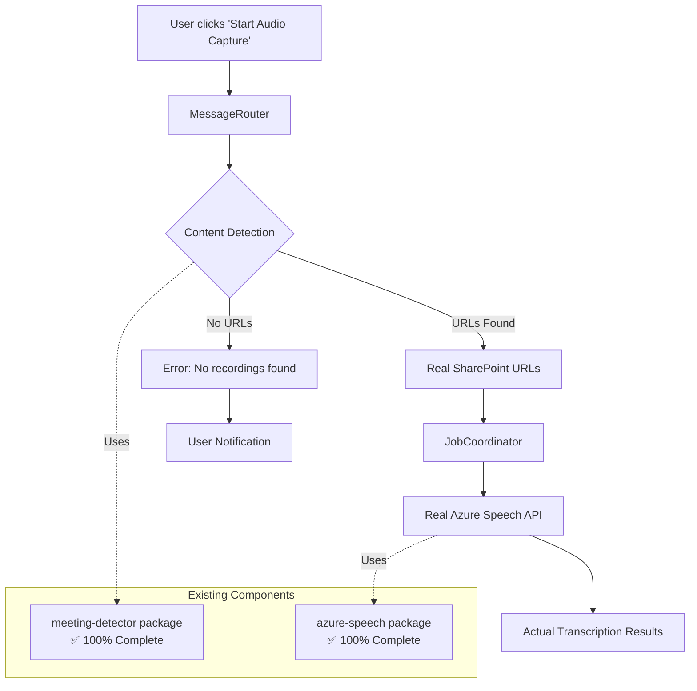

# Design Document

## Overview

This design outlines the integration between the fully implemented Content Detection system and Azure Speech Integration system. The integration transforms the Meeting Summarizer extension from simulation to real functionality by connecting existing, tested components through targeted enhancements to background services.

## Architecture Integration

### Current State Analysis

#### ✅ Fully Implemented Components
1. **Content Detection Package** (`packages/meeting-detector/`)
   - SharePoint URL extraction: `media-url-scanner.ts`
   - Page analysis: `sharepoint-analyzer.ts`  
   - Authentication handling: `auth-token-preserver.ts`
   - All 28 tasks completed, 100% lint compliance

2. **Azure Speech Package** (`packages/azure-speech/`)
   - Real Azure Speech API integration: `batch-transcription-service.ts`
   - Job management: `job-manager.ts`
   - Authentication handling: `auth-handler.ts`
   - All 39 tasks completed, production ready

#### 🔗 Integration Gap
**Current Issue**: JobCoordinator uses simulation instead of connecting real components
```typescript
// Current simulation in job-coordinator.ts:422
audioUrl: job.audioUrl, // 'system://audio-capture' fake URL
// TODO: Integrate with Azure Speech package
const transcriptionResult = await this.executeAzureTranscription(job, transcriptionRequest);
```

### Integration Architecture



## Component Integration Design

### 1. MessageRouter Enhancement

**File**: `chrome-extension/src/background/messaging/message-router.ts`

#### Current Implementation
```typescript
private async handleStartAudioCapture(msg: any): Promise<unknown> {
  const job = {
    jobId,
    audioUrl: msg.audioUrl || 'system://audio-capture', // ❌ Fake URL
    // ... rest of job creation
  };
}
```

#### Enhanced Implementation
```typescript
import { contentDetector } from '@extension/meeting-detector';

private async handleStartAudioCapture(msg: any): Promise<unknown> {
  try {
    // Step 1: Detect content using existing meeting-detector
    const detectionResult = await contentDetector.detectMeetingContent();
    
    if (!detectionResult.audioUrls || detectionResult.audioUrls.length === 0) {
      return {
        success: false,
        error: 'No meeting recordings found on current page',
        suggestion: 'Navigate to a SharePoint page with meeting recordings'
      };
    }
    
    // Step 2: Select best quality URL
    const audioUrl = this.selectBestAudioUrl(detectionResult.audioUrls);
    
    // Step 3: Create job with real URL
    const job = {
      jobId,
      audioUrl, // ✅ Real SharePoint URL
      metadata: {
        ...detectionResult.metadata,
        detectionConfidence: detectionResult.confidence,
        sourceUrls: detectionResult.audioUrls
      },
      // ... rest of job creation
    };
    
    return await this.createTranscriptionJob(job);
  } catch (error) {
    return {
      success: false,
      error: `Content detection failed: ${error.message}`,
      details: error
    };
  }
}

private selectBestAudioUrl(audioUrls: AudioUrlInfo[]): string {
  // Priority: MP4 > WAV > MP3, highest quality first
  const priorityOrder = ['mp4', 'wav', 'mp3'];
  
  for (const format of priorityOrder) {
    const urlsOfFormat = audioUrls.filter(url => url.format === format);
    if (urlsOfFormat.length > 0) {
      // Return highest quality (largest size) URL of this format
      return urlsOfFormat.sort((a, b) => (b.size || 0) - (a.size || 0))[0].url;
    }
  }
  
  // Fallback to first available URL
  return audioUrls[0].url;
}
```

### 2. JobCoordinator Integration

**File**: `chrome-extension/src/background/jobs/job-coordinator.ts`

#### Current Simulation
```typescript
private async executeAzureTranscription(
  job: OrchestrationJob,
  request: CreateTranscriptionJobRequest,
): Promise<TranscriptionResult> {
  // TODO: Integrate with Azure Speech package
  // For now, simulate transcription process
  const simulationSteps = [/* ... simulation ... */];
  return mockResult;
}
```

#### Real Azure Integration
```typescript
import { AzureSpeechService } from '@extension/azure-speech';

private azureSpeechService?: AzureSpeechService;

async initialize(azureConfig: AzureIntegrationConfig): Promise<void> {
  // Initialize real Azure Speech service
  this.azureSpeechService = new AzureSpeechService(azureConfig);
  await this.azureSpeechService.initialize();
}

private async executeAzureTranscription(
  job: OrchestrationJob,
  request: CreateTranscriptionJobRequest,
): Promise<TranscriptionResult> {
  if (!this.azureSpeechService) {
    throw new Error('Azure Speech service not initialized');
  }
  
  try {
    // Step 1: Submit real transcription job
    this.jobTracker.updateJobProgress(job.jobId, 10, 'submitting_to_azure');
    const azureJobResult = await this.azureSpeechService.startTranscription(
      request.audioUrl,
      request.config
    );
    
    if (!azureJobResult.jobId) {
      throw new Error(`Azure job submission failed: ${azureJobResult.message}`);
    }
    
    // Step 2: Monitor real progress
    return await this.monitorAzureTranscription(job.jobId, azureJobResult.jobId);
    
  } catch (error) {
    console.error(`[JobCoordinator] Azure transcription failed:`, error);
    throw error;
  }
}

private async monitorAzureTranscription(
  localJobId: string,
  azureJobId: string
): Promise<TranscriptionResult> {
  const maxAttempts = 120; // 10 minutes with 5-second intervals
  let attempts = 0;
  
  while (attempts < maxAttempts) {
    const statusResult = await this.azureSpeechService!.getTranscriptionStatus(azureJobId);
    
    // Update progress based on real Azure status
    this.updateProgressFromAzureStatus(localJobId, statusResult);
    
    if (statusResult.status === 'completed') {
      // Retrieve actual results
      const transcriptionResult = await this.azureSpeechService!.getTranscriptionResult({
        jobId: azureJobId,
        status: 'completed'
      } as TranscriptionJob);
      
      return {
        jobId: localJobId,
        text: transcriptionResult.text,
        confidence: transcriptionResult.confidence,
        speakers: transcriptionResult.speakers,
        segments: transcriptionResult.segments,
        metadata: transcriptionResult.metadata
      };
    }
    
    if (statusResult.status === 'failed') {
      throw new Error(`Azure transcription failed: ${statusResult.message}`);
    }
    
    // Wait before next poll
    await new Promise(resolve => setTimeout(resolve, 5000));
    attempts++;
  }
  
  throw new Error('Azure transcription timeout');
}

private updateProgressFromAzureStatus(localJobId: string, azureStatus: any): void {
  const stageMapping = {
    'queued': { progress: 20, stage: 'azure_queued' },
    'running': { progress: 50, stage: 'azure_processing' },
    'processing': { progress: 70, stage: 'azure_analyzing' },
    'completed': { progress: 100, stage: 'completed' },
    'failed': { progress: 0, stage: 'failed' }
  };
  
  const mapping = stageMapping[azureStatus.status] || { progress: 30, stage: 'azure_processing' };
  
  this.jobTracker.updateJobProgress(
    localJobId,
    mapping.progress,
    mapping.stage,
    { azureJobId: azureStatus.jobId, azureStatus: azureStatus.status }
  );
}
```

### 3. Background Service Initialization

**File**: `chrome-extension/src/background/services/background-main.ts`

#### Enhanced Initialization
```typescript
import { contentDetector } from '@extension/meeting-detector';
import { AzureSpeechService } from '@extension/azure-speech';

private async initializeServices(): Promise<void> {
  try {
    // Initialize existing services
    await this.initializeExistingServices();
    
    // Initialize content detection
    await contentDetector.initialize();
    
    // Initialize Azure Speech service with stored credentials
    const azureConfig = await this.loadAzureConfiguration();
    if (azureConfig.subscriptionKey && azureConfig.serviceRegion) {
      await this.jobCoordinator.initialize(azureConfig);
      console.log('[BackgroundMain] Azure Speech service initialized');
    } else {
      console.warn('[BackgroundMain] Azure Speech credentials not configured');
    }
    
    console.log('[BackgroundMain] All services initialized successfully');
  } catch (error) {
    console.error('[BackgroundMain] Service initialization failed:', error);
    throw error;
  }
}

private async loadAzureConfiguration(): Promise<AzureIntegrationConfig> {
  // Load from chrome.storage or configuration service
  const config = await chrome.storage.sync.get(['azureSpeechConfig']);
  return config.azureSpeechConfig || {
    enabled: false,
    maxConcurrentCalls: 3,
    apiTimeout: 30000,
    enableRetry: true,
    retry: {
      maxAttempts: 3,
      initialDelay: 1000,
      backoffFactor: 2,
      maxDelay: 10000
    }
  };
}
```

## Error Handling Integration

### Content Detection Errors
```typescript
// In MessageRouter
if (detectionResult.error) {
  return {
    success: false,
    error: `Content detection failed: ${detectionResult.error}`,
    errorType: 'content_detection',
    recovery: [
      'Ensure you are on a SharePoint page with meeting recordings',
      'Check that you have permission to access the meeting content',
      'Try refreshing the page and attempting again'
    ]
  };
}
```

### Azure Speech Errors
```typescript
// In JobCoordinator
catch (error) {
  const errorInfo = {
    success: false,
    error: `Transcription failed: ${error.message}`,
    errorType: 'azure_speech',
    recovery: []
  };
  
  if (error.message.includes('quota')) {
    errorInfo.recovery.push('Azure Speech API quota exceeded - try again later');
  } else if (error.message.includes('authentication')) {
    errorInfo.recovery.push('Azure Speech credentials invalid - check configuration');
  } else if (error.message.includes('network')) {
    errorInfo.recovery.push('Network connectivity issue - check internet connection');
  }
  
  throw errorInfo;
}
```

## Progress Update Integration

### Real Azure Progress
```typescript
// Replace simulation stages with real Azure Speech API stages
const realProgressStages = {
  'submitting_to_azure': 10,
  'azure_queued': 20,
  'azure_validating': 30,
  'azure_processing': 50,
  'azure_analyzing': 70,
  'azure_diarization': 85,
  'azure_finalizing': 95,
  'completed': 100
};
```

## Configuration Integration

### Azure Speech Setup Validation
```typescript
// In options page - validate that Azure configuration works with real URLs
async function testAzureConfiguration(config: AzureSpeechConfig): Promise<boolean> {
  try {
    const azureService = new AzureSpeechService(config);
    await azureService.initialize();
    
    // Test with a sample URL or connectivity test
    const testResult = await azureService.testConnection();
    return testResult;
  } catch (error) {
    console.error('Azure configuration test failed:', error);
    return false;
  }
}
```

## Implementation Strategy

### Phase 1: MessageRouter Enhancement
1. Add content detection integration to `handleStartAudioCapture`
2. Implement URL selection logic
3. Add error handling for content detection failures

### Phase 2: JobCoordinator Integration  
1. Replace `executeAzureTranscription` simulation with real Azure Speech calls
2. Implement real progress monitoring
3. Add Azure Speech error handling

### Phase 3: Background Service Coordination
1. Update BackgroundMain initialization
2. Add Azure configuration loading
3. Ensure proper service lifecycle management

### Phase 4: Testing and Validation
1. Test content detection → transcription flow
2. Validate error handling scenarios
3. Verify progress updates accuracy

## Success Metrics

### Technical Integration
- ✅ Real SharePoint URLs flow from content-detection to azure-speech
- ✅ No more 'system://audio-capture' fake URLs in job processing
- ✅ Actual Azure Speech API calls replace simulation
- ✅ Real transcription results returned to users

### User Experience
- ✅ Seamless operation from user perspective
- ✅ Real progress updates showing actual Azure processing stages
- ✅ Proper error messages for both content detection and transcription failures
- ✅ Actual meeting transcriptions with speaker diarization and confidence scores

This design leverages the 100% completed content-detection and azure-speech packages to create a fully functional real transcription system through targeted background service integration.