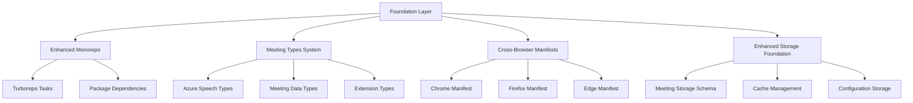

# Design Document

## Overview

The Foundation Layer design establishes the core infrastructure for the Meeting Summarizer Chrome Extension, building upon the existing monorepo structure while adding meeting-specific enhancements. This layer provides the enhanced TypeScript type system, Chrome Extension Manifest v3 configuration, cross-browser compatibility framework, and storage foundation that all other components will depend on.

## Steering Document Alignment

### Technical Standards (tech.md)
- **Monorepo Management**: Leverages existing Turborepo 2.5.5 configuration with enhanced task definitions
- **TypeScript Standards**: Extends existing strict TypeScript 5.9.2 configuration with meeting-specific types
- **Chrome Extension Framework**: Uses Manifest v3 with Service Worker architecture as documented
- **Cross-Browser Support**: Implements documented Chrome, Edge, Firefox compatibility strategy

### Project Structure (structure.md)
- **Package Organization**: Follows established packages/ directory structure with new meeting-specific packages
- **File Naming**: Adheres to documented kebab-case for services, PascalCase for components conventions
- **Import Patterns**: Uses documented absolute imports from package roots and relative imports within packages
- **Configuration Structure**: Maintains documented root-level and package-specific configuration patterns

## Code Reuse Analysis

### Existing Components to Leverage
- **Turborepo Configuration**: Extend existing turbo.json with meeting-specific tasks
- **Storage Package**: Build upon packages/storage for meeting data structures
- **Shared Package**: Extend packages/shared with meeting-specific types and utilities
- **UI Package**: Leverage existing component library for meeting interfaces
- **TypeScript Configs**: Extend existing tsconfig hierarchy

### Integration Points
- **Chrome Storage API**: Integrate with existing storage/lib/base/base.ts for enhanced meeting storage
- **Manifest Generation**: Extend chrome-extension/utils/plugins/make-manifest-plugin.ts for cross-browser support
- **Build System**: Integrate with existing Vite configuration for enhanced development workflow
- **HMR System**: Leverage packages/hmr for meeting-specific hot reload capabilities

## Architecture



## Components and Interfaces

### Enhanced Monorepo Manager
- **Purpose:** Extends existing Turborepo configuration with meeting-specific build tasks and package management
- **Interfaces:** Enhanced turbo.json, package.json scripts, dependency management
- **Dependencies:** Existing Turborepo configuration, PNPM workspace setup
- **Reuses:** Current turbo.json structure, existing build pipelines

### Meeting Type System
- **Purpose:** Provides comprehensive TypeScript types for all meeting-related data structures and Azure integration
- **Interfaces:** Exported type definitions, interfaces, enums for meeting domain
- **Dependencies:** Existing shared types, Chrome Extension types
- **Reuses:** packages/shared type organization patterns

### Cross-Browser Manifest System
- **Purpose:** Generates browser-specific manifests from common configuration
- **Interfaces:** Manifest generation functions, browser detection utilities
- **Dependencies:** Existing manifest plugin, browser-specific requirements
- **Reuses:** chrome-extension/utils/plugins/make-manifest-plugin.ts patterns

### Enhanced Storage Foundation
- **Purpose:** Extends existing storage system with meeting-specific schemas and caching
- **Interfaces:** Meeting storage interfaces, cache management APIs
- **Dependencies:** Existing storage base classes, Chrome Storage API
- **Reuses:** packages/storage/lib/base architecture

## Data Models

### MeetingRecord
```typescript
interface MeetingRecord {
  id: string; // Unique meeting identifier
  metadata: MeetingMetadata;
  transcription?: TranscriptionResult;
  summary?: MeetingSummary;
  createdAt: Date;
  updatedAt: Date;
  status: 'pending' | 'processing' | 'completed' | 'failed';
}
```

### AzureSpeechConfig
```typescript
interface AzureSpeechConfig {
  subscriptionKey: string; // Encrypted Azure subscription key
  serviceRegion: string; // Azure service region
  endpoint: string; // Full Azure endpoint URL
  language: string; // Primary language code
  outputFormat: 'detailed' | 'simple';
  enableSpeakerDiarization?: boolean;
}
```

### ExtensionStorageSchema
```typescript
interface ExtensionStorageSchema {
  meetings: Record<string, MeetingRecord>;
  azureConfig?: AzureSpeechConfig;
  userPreferences: UserPreferences;
  cache: {
    transcriptions: Record<string, CachedTranscription>;
    urlHashes: Record<string, string>;
  };
}
```

## Error Handling

### Error Scenarios
1. **Storage Quota Exceeded**
   - **Handling:** Implement intelligent cleanup with user confirmation, prioritize recent meetings
   - **User Impact:** Clear notification with storage management options

2. **Manifest Generation Failure**
   - **Handling:** Fallback to default browser manifest, log specific build errors
   - **User Impact:** Extension may have limited features in affected browser

3. **Type Validation Failure**
   - **Handling:** Runtime type guards with detailed error reporting, graceful degradation
   - **User Impact:** Feature may be disabled with clear explanation

4. **Cross-Browser API Incompatibility**
   - **Handling:** Feature detection with appropriate fallbacks, progressive enhancement
   - **User Impact:** Some features may be unavailable with explanation

## Testing Strategy

### Unit Testing
- Test enhanced TypeScript type validation and type guards
- Test storage schema migrations and data integrity
- Test manifest generation for each target browser
- Test cross-browser API compatibility helpers

### Integration Testing
- Test storage integration with existing packages/storage
- Test Turborepo task orchestration with new meeting-specific tasks
- Test type system integration across all packages
- Test manifest compatibility with browser extension stores

### End-to-End Testing
- Test complete extension loading across Chrome, Edge, Firefox
- Test storage persistence across browser restarts
- Test development workflow with enhanced HMR
- Test build and packaging for all target browsers