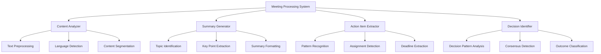

# Design Document

## Overview

The Meeting Processing System design provides AI-powered analysis of transcribed meeting content, implementing intelligent summarization, action item extraction, decision identification, and multi-language content processing. This system transforms raw transcription data into valuable business insights while maintaining accuracy and reliability.

## Steering Document Alignment

### Technical Standards (tech.md)
- **Processing Pipeline**: Implements documented transcription result processing workflow
- **AI Integration**: Follows documented patterns for local processing without external AI dependencies
- **Performance Standards**: Adheres to documented processing efficiency and memory management
- **Content Security**: Implements documented privacy protection for meeting content processing

### Project Structure (structure.md)
- **Package Organization**: Creates packages/meeting-parser for content processing services
- **Service Layer**: Implements documented application service patterns for business logic
- **Type Definitions**: Uses documented type organization for processing-related interfaces
- **Utility Integration**: Leverages documented shared utility patterns

## Code Reuse Analysis

### Existing Components to Leverage
- **Shared Utilities**: Extend packages/shared/lib/utils with text processing and analysis utilities
- **Storage Integration**: Use enhanced storage system for processed results and caching
- **Type System**: Build upon foundation layer meeting-specific type definitions
- **Background Coordination**: Integrate with background service for processing job management

### Integration Points
- **Azure Speech Results**: Process TranscriptionResult data from Azure Speech integration
- **Storage System**: Store processed summaries and action items in meeting records
- **UI Display**: Provide formatted results for summary display components
- **Background Service**: Coordinate processing jobs with transcription completion events

## Architecture



## Components and Interfaces

### ContentAnalyzer
- **Purpose:** Preprocesses transcription text and performs structural analysis for downstream processing
- **Interfaces:** Analyze content, detect language, segment text, identify speakers, extract metadata
- **Dependencies:** Text processing utilities, language detection libraries, speaker identification
- **Reuses:** Shared text utilities, parsing patterns, content validation functions

### SummaryGenerator
- **Purpose:** Generates intelligent meeting summaries with hierarchical organization and key point extraction
- **Interfaces:** Generate summaries, identify topics, extract key points, format output, validate quality
- **Dependencies:** Content analysis results, topic modeling, text summarization algorithms
- **Reuses:** Text processing utilities, formatting patterns, content validation

### ActionItemExtractor
- **Purpose:** Identifies and extracts action items with assignment and deadline detection from meeting content
- **Interfaces:** Extract actions, identify assignments, detect deadlines, classify priority, validate completeness
- **Dependencies:** Pattern recognition, natural language processing, temporal extraction
- **Reuses:** Shared parsing utilities, validation patterns, data formatting functions

### DecisionIdentifier
- **Purpose:** Identifies key decisions made during meetings with context and outcome classification
- **Interfaces:** Identify decisions, extract context, classify outcomes, validate significance, format results
- **Dependencies:** Decision pattern analysis, consensus detection, outcome classification
- **Reuses:** Content analysis utilities, classification patterns, validation functions

## Data Models

### ProcessingResult
```typescript
interface ProcessingResult {
  meetingId: string;
  summary: MeetingSummary;
  actionItems: ActionItem[];
  decisions: Decision[];
  keyTopics: Topic[];
  processingMetadata: ProcessingMetadata;
  confidence: ProcessingConfidence;
  generatedAt: Date;
}
```

### MeetingSummary
```typescript
interface MeetingSummary {
  overview: string; // High-level meeting summary
  keyPoints: string[]; // Important discussion points
  outcomes: string[]; // Meeting results and conclusions
  nextSteps: string[]; // Follow-up actions and plans
  structure: {
    introduction?: string;
    mainDiscussion: string;
    conclusion?: string;
  };
  topics: TopicSummary[];
}
```

### ActionItem
```typescript
interface ActionItem {
  id: string;
  task: string; // Clear description of the action
  assignee?: string; // Identified responsible party
  deadline?: Date; // Extracted or inferred deadline
  priority: 'high' | 'medium' | 'low';
  context: string; // Surrounding discussion context
  source: TextSegment; // Reference to original transcription
  confidence: number; // Extraction confidence 0.0-1.0
  status: 'identified' | 'validated' | 'disputed';
}
```

### Decision
```typescript
interface Decision {
  id: string;
  decision: string; // Clear statement of what was decided
  context: string; // Background and reasoning
  participants: string[]; // People involved in decision
  consensus: 'unanimous' | 'majority' | 'split' | 'unclear';
  impact: 'high' | 'medium' | 'low';
  implementation?: string; // How decision will be implemented
  source: TextSegment; // Reference to original transcription
  confidence: number; // Identification confidence 0.0-1.0
}
```

## Error Handling

### Error Scenarios
1. **Low Quality Transcription**
   - **Handling:** Confidence scoring, partial processing, quality warnings, graceful degradation
   - **User Impact:** Quality indicators with suggestions for improvement

2. **Ambiguous Content**
   - **Handling:** Multiple interpretation handling, confidence indicators, user review options
   - **User Impact:** Uncertainty indicators with option for manual review

3. **Processing Timeout**
   - **Handling:** Chunked processing, progress tracking, partial result delivery, resume capability
   - **User Impact:** Progress indication with option to continue or accept partial results

4. **Language Processing Errors**
   - **Handling:** Language detection validation, fallback processing, error categorization
   - **User Impact:** Clear error messages with language-specific guidance

## Testing Strategy

### Unit Testing
- Test content analysis with various transcription quality levels and formats
- Test summary generation with different meeting types and lengths
- Test action item extraction with various language patterns and assignments
- Test decision identification with different consensus and clarity levels

### Integration Testing
- Test integration with Azure Speech transcription results
- Test coordination with background service for processing job management
- Test storage integration for processed result persistence
- Test UI integration for summary and action item display

### End-to-End Testing
- Test complete processing workflow from transcription to formatted output
- Test accuracy validation with known meeting content and expected outcomes
- Test performance with large transcriptions and complex meeting content
- Test multi-language processing with international meeting scenarios