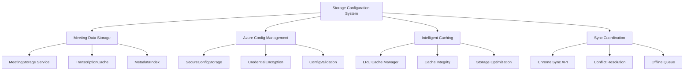

# Design Document

## Overview

The Storage Configuration System design extends the existing Chrome Storage foundation to provide specialized storage capabilities for meeting transcriptions, Azure API configuration, and intelligent caching. This system builds upon the established storage patterns while adding enterprise-grade data management, encryption, and performance optimization.

## Steering Document Alignment

### Technical Standards (tech.md)
- **Storage Architecture**: Follows documented Chrome Storage API integration patterns
- **Encryption Standards**: Implements secure credential storage as specified in security considerations
- **Performance Optimization**: Adheres to documented caching and memory management guidelines
- **API Integration**: Aligns with Azure Speech API configuration requirements

### Project Structure (structure.md)
- **Package Organization**: Extends packages/storage with meeting-specific storage modules
- **File Naming**: Follows kebab-case conventions for storage service files
- **Service Layer**: Implements documented service layer patterns for data persistence
- **Type Organization**: Uses documented type organization in types/ subdirectories

## Code Reuse Analysis

### Existing Components to Leverage
- **Storage Base Classes**: Extend packages/storage/lib/base/base.ts for meeting storage
- **Storage Enums**: Build upon packages/storage/lib/base/enums.ts for storage types
- **Example Storage**: Adapt packages/storage/lib/impl/example-theme-storage.ts patterns
- **Storage Types**: Extend packages/storage/lib/types.ts with meeting-specific interfaces

### Integration Points
- **Chrome Storage API**: Deep integration with existing storage abstraction layer
- **Shared Utilities**: Integrate with packages/shared/lib/utils for data validation
- **Background Service**: Connect with Service Worker for storage coordination
- **Type System**: Integrate with foundation layer type definitions

## Architecture



## Components and Interfaces

### MeetingStorage Service
- **Purpose:** Manages meeting transcriptions, summaries, and metadata with optimized storage patterns
- **Interfaces:** Store, retrieve, update, delete meetings; batch operations; search/filter capabilities
- **Dependencies:** Chrome Storage API, data compression utilities, storage base classes
- **Reuses:** packages/storage/lib/base/base.ts storage abstraction patterns

### SecureConfigStorage
- **Purpose:** Handles Azure API credentials with encryption and secure access patterns
- **Interfaces:** Store encrypted config, retrieve with auto-decrypt, validate settings, test connectivity
- **Dependencies:** Chrome Storage encryption APIs, credential validation services
- **Reuses:** Existing storage security patterns, configuration management

### IntelligentCache Manager
- **Purpose:** Provides LRU caching for transcription results with integrity checking and optimization
- **Interfaces:** Cache operations, eviction policies, integrity validation, performance monitoring
- **Dependencies:** Storage quota management, hash generation utilities
- **Reuses:** Existing caching patterns, performance optimization utilities

### SyncCoordinator
- **Purpose:** Manages data synchronization across browsers with conflict resolution
- **Interfaces:** Sync enable/disable, conflict detection, resolution strategies, sync status
- **Dependencies:** Chrome Storage sync API, data merging utilities
- **Reuses:** Existing sync patterns, storage coordination mechanisms

## Data Models

### MeetingStorageRecord
```typescript
interface MeetingStorageRecord {
  id: string; // SHA-256 hash of meeting URL + timestamp
  meeting: MeetingRecord; // Core meeting data
  compressedTranscription?: Uint8Array; // Compressed transcription data
  searchableText: string; // Indexed text for search
  tags: string[]; // User-defined tags
  storageSize: number; // Size in bytes for quota management
}
```

### SecureConfigRecord
```typescript
interface SecureConfigRecord {
  encryptedApiKey: string; // AES-256 encrypted subscription key
  region: string; // Azure service region
  language: string; // Default language setting
  preferences: {
    autoTranscribe: boolean;
    notificationLevel: 'all' | 'errors' | 'none';
    cacheRetentionDays: number;
  };
  lastValidated: Date; // Last successful API validation
}
```

### CacheEntry
```typescript
interface CacheEntry {
  urlHash: string; // SHA-256 hash of source URL
  transcriptionResult: TranscriptionResult;
  accessCount: number; // For LRU eviction
  lastAccessed: Date;
  integrity: string; // Data integrity checksum
  compressionRatio: number; // Storage optimization metric
}
```

## Error Handling

### Error Scenarios
1. **Storage Quota Exceeded**
   - **Handling:** Intelligent cleanup with user approval, prioritize by access patterns and date
   - **User Impact:** Storage management dialog with size impact estimates

2. **Encryption/Decryption Failure**
   - **Handling:** Secure key regeneration, credential re-entry prompt, data integrity checks
   - **User Impact:** Re-authentication required with clear security messaging

3. **Cache Corruption**
   - **Handling:** Integrity verification, automatic cache rebuild, corrupted entry removal
   - **User Impact:** Temporary performance impact with progress indication

4. **Sync Conflicts**
   - **Handling:** Last-write-wins with backup, user notification of conflicts, manual resolution option
   - **User Impact:** Conflict notification with option to review changes

## Testing Strategy

### Unit Testing
- Test storage operations with various data sizes and types
- Test encryption/decryption with edge cases and error conditions
- Test cache eviction policies and integrity validation
- Test sync conflict resolution algorithms

### Integration Testing
- Test integration with existing storage base classes
- Test Chrome Storage API interactions with quota management
- Test background service coordination for storage operations
- Test cross-browser sync functionality

### End-to-End Testing
- Test complete meeting storage workflow from transcription to retrieval
- Test Azure config setup and validation workflow
- Test storage cleanup and optimization procedures
- Test sync across multiple browser instances