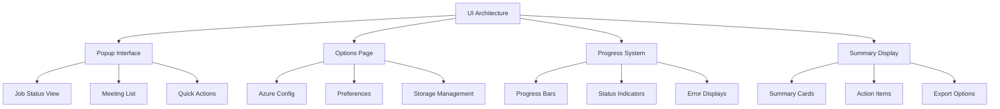

# Design Document

## Overview

The UI Architecture design provides a comprehensive React-based user interface system for the Meeting Summarizer extension, implementing responsive design principles with TypeScript and Tailwind CSS. This system includes popup interfaces, options pages, progress monitoring, and meeting summary displays that create a cohesive and professional user experience.

## Steering Document Alignment

### Technical Standards (tech.md)
- **React Framework**: Uses documented React 19.1.1 with TypeScript for component development
- **Styling System**: Implements documented Tailwind CSS 3.4.17 integration patterns
- **State Management**: Follows documented React hooks with Chrome Storage API integration
- **UI Components**: Builds upon documented packages/ui component library

### Project Structure (structure.md)
- **Component Organization**: Follows documented PascalCase naming and component directory structure
- **Page Structure**: Extends documented pages/ organization for popup and options interfaces
- **Styling Configuration**: Uses documented Tailwind configuration hierarchy
- **Import Patterns**: Implements documented absolute imports and barrel exports

## Code Reuse Analysis

### Existing Components to Leverage
- **UI Package Components**: Extend packages/ui/lib/components with meeting-specific interfaces
- **Popup Structure**: Build upon pages/popup/src existing React application structure
- **Options Structure**: Extend pages/options/src with meeting configuration interfaces
- **Shared Hooks**: Use packages/shared/lib/hooks for storage integration and state management

### Integration Points
- **Background Service**: Integrate with Service Worker for real-time job status updates
- **Storage System**: Connect with enhanced storage for meeting data and configuration access
- **Content Scripts**: Coordinate with injected UI elements for consistent user experience
- **Azure Integration**: Provide configuration interfaces for Azure Speech API setup

## Architecture



## Components and Interfaces

### PopupInterface
- **Purpose:** Provides comprehensive meeting management interface within extension popup constraints
- **Interfaces:** Display active jobs, show recent meetings, provide quick actions, handle navigation
- **Dependencies:** Background service communication, storage access, React routing
- **Reuses:** Existing popup structure, UI components, background communication patterns

### OptionsPage
- **Purpose:** Comprehensive configuration interface for Azure setup, preferences, and storage management
- **Interfaces:** Configure Azure API, manage preferences, handle storage operations, provide testing tools
- **Dependencies:** Secure configuration storage, validation utilities, Azure API testing
- **Reuses:** Existing options page structure, form components, validation patterns

### ProgressMonitoringSystem
- **Purpose:** Real-time progress display system with error handling and status communication
- **Interfaces:** Display progress, show status updates, handle errors, provide user feedback
- **Dependencies:** Background service events, progress calculation utilities, error classification
- **Reuses:** Existing UI components, event handling patterns, error display components

### MeetingSummaryDisplay
- **Purpose:** Organized display of meeting summaries, action items, and transcription results
- **Interfaces:** Render summaries, display action items, provide search/filter, handle exports
- **Dependencies:** Meeting processing results, export utilities, search functionality
- **Reuses:** Existing UI components, data display patterns, export utilities

## Data Models

### PopupState
```typescript
interface PopupState {
  activeJobs: TranscriptionJob[];
  recentMeetings: MeetingRecord[];
  currentView: 'jobs' | 'meetings' | 'settings';
  connectionStatus: 'connected' | 'disconnected' | 'error';
  lastUpdate: Date;
  userPreferences: UIPreferences;
}
```

### OptionsPageState
```typescript
interface OptionsPageState {
  azureConfig: AzureSpeechConfig;
  isConfigValid: boolean;
  testResults?: ConfigTestResult;
  storageStats: StorageStatistics;
  userPreferences: UserPreferences;
  isDirty: boolean;
  validationErrors: ValidationError[];
}
```

### ProgressDisplayState
```typescript
interface ProgressDisplayState {
  jobProgress: Map<string, JobProgress>;
  overallStatus: 'idle' | 'processing' | 'paused' | 'error';
  estimatedCompletion?: Date;
  errorStates: Map<string, ErrorState>;
  notificationQueue: Notification[];
}
```

## Error Handling

### Error Scenarios
1. **Background Service Connection Loss**
   - **Handling:** Connection monitoring, reconnection attempts, cached state display
   - **User Impact:** Connection status indicator with automatic retry

2. **Configuration Validation Errors**
   - **Handling:** Real-time validation, specific error messages, guided correction
   - **User Impact:** Inline error messages with actionable correction guidance

3. **UI Rendering Errors**
   - **Handling:** Error boundaries, graceful degradation, component isolation
   - **User Impact:** Partial UI functionality with error reporting option

4. **Data Loading Failures**
   - **Handling:** Loading states, retry mechanisms, fallback content
   - **User Impact:** Loading indicators with retry options for failed operations

## Testing Strategy

### Unit Testing
- Test React components with various props and state configurations
- Test UI state management with different user interaction scenarios
- Test error boundaries and error handling with component failure simulation
- Test responsive design with different viewport sizes and configurations

### Integration Testing
- Test integration with background service for real-time updates
- Test storage integration for configuration and meeting data access
- Test cross-component communication and state synchronization
- Test accessibility features with screen reader and keyboard navigation

### End-to-End Testing
- Test complete user workflows from configuration to meeting summary review
- Test popup interface behavior with various job states and meeting data
- Test options page functionality with configuration changes and validation
- Test responsive behavior across different browser window sizes and orientations